# What is LSTM? Introduction to Long Short-Term Memory

Long Short-Term Memory Networks or LSTM in deep learning, is a sequential neural network that allows information to persist. It is a special type of Recurrent Neural Network which is capable of handling the vanishing gradient problem faced by RNN. LSTM was designed by Hochreiter and Schmidhuber that resolves the problem caused by traditional rnns and machine learning algorithms. LSTM Model can be implemented in Python using the Keras library.

Let’s say while watching a video, you remember the previous scene, or while reading a book, you know what happened in the earlier chapter. RNNs work similarly; they remember the previous information and use it for processing the current input. The shortcoming of RNN is they cannot remember long-term dependencies due to vanishing gradient. LSTMs are explicitly designed to avoid long-term dependency problems.

- [What is LSTM? Introduction to Long Short-Term Memory](#what-is-lstm-introduction-to-long-short-term-memory)
  - [What is LSTM?](#what-is-lstm)
  - [LSTM Architecture](#lstm-architecture)
      - [The Logic Behind LSTM](#the-logic-behind-lstm)
      - [Example of LTSM Working](#example-of-ltsm-working)
  - [Forget Gate](#forget-gate)
  - [Input Gate](#input-gate)
  - [New Information](#new-information)
  - [Output Gate](#output-gate)
  - [LTSM vs RNN](#ltsm-vs-rnn)
  - [What are Bidirectional LSTMs?](#what-are-bidirectional-lstms)
  - [Conclusion](#conclusion)

## What is LSTM?

LSTM (Long Short-Term Memory) is a recurrent neural network (RNN) architecture widely used in Deep Learning. It excels at capturing long-term dependencies, making it ideal for sequence prediction tasks.

Unlike traditional neural networks, LSTM incorporates feedback connections, allowing it to process entire sequences of data, not just individual data points. This makes it highly effective in understanding and predicting patterns in sequential data like time series, text, and speech.

LSTM has become a powerful tool in artificial intelligence and deep learning, enabling breakthroughs in various fields by uncovering valuable insights from sequential data.

## LSTM Architecture

In the introduction to long short-term memory, we learned that it resolves the vanishing gradient problem faced by RNN, so now, in this section, we will see how it resolves this problem by learning the architecture of the LSTM. At a high level, LSTM works very much like an RNN cell. Here is the internal functioning of the [**LSTM network**](https://www.analyticsvidhya.com/blog/2022/03/an-overview-on-long-short-term-memory-lstm/). The LSTM network architecture consists of three parts, as shown in the image below, and each part performs an individual function.

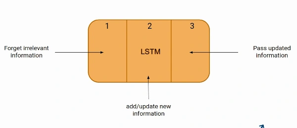

#### The Logic Behind LSTM

The first part chooses whether the information coming from the previous timestamp is to be remembered or is irrelevant and can be forgotten. In the second part, the cell tries to learn new information from the input to this cell. At last, in the third part, the cell passes the updated information from the current timestamp to the next timestamp. This one cycle of LSTM is considered a single-time step.

These three parts of an LSTM unit are known as gates. They control the flow of information in and out of the memory cell or lstm cell. The first gate is called Forget gate, the second gate is known as the Input gate, and the last one is the Output gate. An LSTM unit that consists of these three gates and a memory cell or lstm cell can be considered as a layer of neurons in traditional feedforward neural network, with each neuron having a hidden layer and a current state.

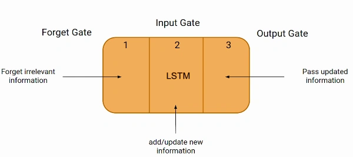

Just like a simple RNN, an LSTM also has a hidden state where H(t-1) represents the hidden state of the previous timestamp and Ht is the hidden state of the current timestamp. In addition to that, LSTM also has a cell state represented by C(t-1) and C(t) for the previous and current timestamps, respectively.

Here the hidden state is known as Short term memory, and the cell state is known as Long term memory. Refer to the following image.

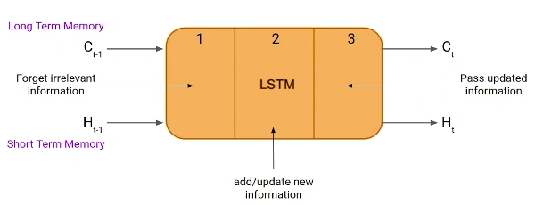

It is interesting to note that the cell state carries the information along with all the timestamps.

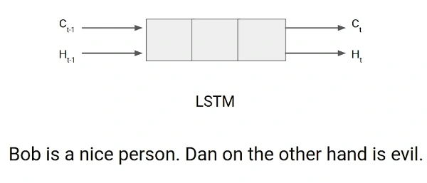

#### Example of LTSM Working

Let’s take an example to understand how LSTM works. Here we have two sentences separated by a full stop. The first sentence is “Bob is a nice person,” and the second sentence is “Dan, on the Other hand, is evil”. It is very clear, in the first sentence, we are talking about Bob, and as soon as we encounter the full stop(.), we started talking about Dan.

As we move from the first sentence to the second sentence, our network should realize that we are no more talking about Bob. Now our subject is Dan. Here, the Forget gate of the network allows it to forget about it. Let’s understand the roles played by these gates in LSTM architecture.

## Forget Gate

In a cell of the LSTM [neural network](https://www.analyticsvidhya.com/blog/2022/01/introduction-to-neural-networks/), the first step is to decide whether we should keep the information from the previous time step or forget it. Here is the equation for forget gate.

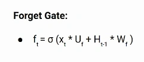

Let’s try to understand the equation, here

- Xt: input to the current timestamp.
- Uf: weight associated with the input
- Ht-1: The hidden state of the previous timestamp
- Wf: It is the weight matrix associated with the hidden state

Later, a sigmoid function is applied to it. That will make ft a number between 0 and 1. This ft is later multiplied with the cell state of the previous timestamp, as shown below.

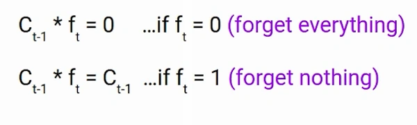

## Input Gate

Let’s take another example.

“Bob knows swimming. He told me over the phone that he had served the navy for four long years.”

So, in both these sentences, we are talking about Bob. However, both give different kinds of information about Bob. In the first sentence, we get the information that he knows swimming. Whereas the second sentence tells, he uses the phone and served in the navy for four years.

Now just think about it, based on the context given in the first sentence, which information in the second sentence is critical? First, he used the phone to tell, or he served in the navy. In this context, it doesn’t matter whether he used the phone or any other medium of communication to pass on the information. The fact that he was in the navy is important information, and this is something we want our model to remember for future computation. This is the task of the Input gate.

The input gate is used to quantify the importance of the new information carried by the input. Here is the equation of the input gate

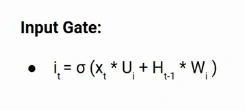

Here,

- Xt: Input at the current timestamp t
- Ui: weight matrix of input
- Ht-1: A hidden state at the previous timestamp
- Wi: Weight matrix of input associated with hidden state

Again we have applied the sigmoid function over it. As a result, the value of I at timestamp t will be between 0 and 1.

## New Information

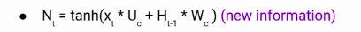

Now the new information that needed to be passed to the cell state is a function of a hidden state at the previous timestamp t-1 and input x at timestamp t. The activation function here is tanh. Due to the tanh function, the value of new information will be between -1 and 1. If the value of Nt is negative, the information is subtracted from the cell state, and if the value is positive, the information is added to the cell state at the current timestamp.

However, the Nt won’t be added directly to the cell state. Here comes the updated equation:

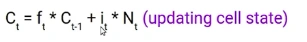

Here, Ct-1 is the cell state at the current timestamp, and the others are the values we have calculated previously.

## Output Gate

Now consider this sentence.

“Bob single-handedly fought the enemy and died for his country. For his contributions, brave\_\_\_\_\_\_.”

During this task, we have to complete the second sentence. Now, the minute we see the word brave, we know that we are talking about a person. In the sentence, only Bob is brave, we can not say the enemy is brave, or the country is brave. So based on the current expectation, we have to give a relevant word to fill in the blank. That word is our output, and this is the function of our Output gate.

Here is the equation of the Output gate, which is pretty similar to the two previous gates.

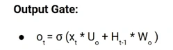

Its value will also lie between 0 and 1 because of this sigmoid function. Now to calculate the current hidden state, we will use Ot and tanh of the updated cell state. As shown below.

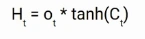

It turns out that the hidden state is a function of Long term memory (Ct) and the current output. If you need to take the output of the current timestamp, just apply the SoftMax activation on hidden state Ht.

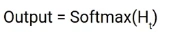

Here the token with the maximum score in the output is the prediction.

This is the More intuitive diagram of the LSTM network.

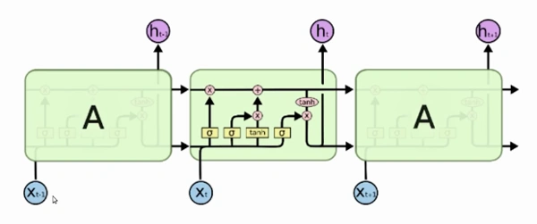

This diagram is taken from an interesting blog. I urge you all to go through it. Here is the link: [_**Understanding LSTM Networks**_](https://colah.github.io/posts/2015-08-Understanding-LSTMs/)!

## LTSM vs RNN

If you are looking to kick-start your Data Science Journey and want every topic under one roof, your search stops here. Check out Analytics Vidhya’s Certified AI & ML BlackBelt Plus Program.

## What are Bidirectional LSTMs?

Bidirectional LSTMs (Long Short-Term Memory) are a type of recurrent neural network (RNN) architecture that processes input data in both forward and backward directions. In a traditional LSTM, the information flows only from past to future, making predictions based on the preceding context. However, in bidirectional LSTMs, the network also considers future context, enabling it to capture dependencies in both directions.

The bidirectional LSTM comprises two LSTM layers, one processing the input sequence in the forward direction and the other in the backward direction. This allows the network to access information from past and future time steps simultaneously. As a result, bidirectional LSTMs are particularly useful for tasks that require a comprehensive understanding of the input sequence, such as natural language processing tasks like sentiment analysis, machine translation, and named entity recognition.

By incorporating information from both directions, bidirectional LSTMs enhance the model’s ability to capture long-term dependencies and make more accurate predictions in complex sequential data.

## Conclusion

In this article, we covered the basics and sequential architecture of a Long Short-Term Memory Network model. Knowing how it works helps you design an LSTM model with ease and better understanding. It is an important topic to cover as LSTM models are widely used in artificial intelligence for natural language processing tasks like language modeling and machine translation. Some other applications of lstm are speech recognition, image captioning, handwriting recognition, time series forecasting by learning time series data, etc.
