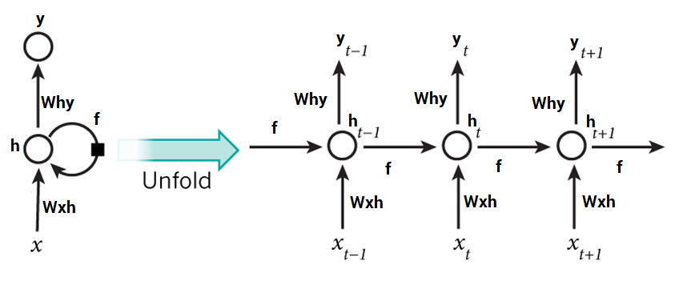

# Essentials of Deep Learning : Introduction to Long Short Term Memory

Long Short Term Memory Networks Sequence prediction problems have been around for a long time. They are considered as one of the hardest problems to solve in the data science industry. These include a wide range of problems; from predicting sales to finding patterns in stock markets’ data, from understanding movie plots to recognizing your way of speech, from language translations to predicting your next word on your iPhone’s keyboard.

With the recent breakthroughs that have been happening in data science, it is found that for almost all of these sequence prediction problems, Long short Term Memory networks, a.k.a LSTMs have been observed as the most effective solution.

LSTMs have an edge over conventional feed-forward [**neural networks and RNN**](https://www.analyticsvidhya.com/blog/2022/03/a-brief-overview-of-recurrent-neural-networks-rnn/) in many ways. This is because of their property of selectively remembering patterns for long durations of time.  The purpose of this article is to explain LSTM and enable you to use it in real life problems.  Let’s have a look!

## Flashback: A look into Recurrent Neural Networks (RNN)

Take an example of sequential data, which can be the stock market’s data for a particular stock. A simple machine learning model or an Artificial Neural Network may learn to predict the stock prices based on a number of features: the volume of the stock, the opening value etc. While the price of the stock depends on these features, it is also largely dependent on the stock values in the previous days. In fact for a trader, these values in the previous days (or the trend) is one major deciding factor for predictions.

In the conventional feed-forward neural networks, all test cases are considered to be independent. That is when fitting the model for a particular day, there is no consideration for the stock prices on the previous days.

This dependency on time is achieved via **[Recurrent Neural Networks](https://www.analyticsvidhya.com/blog/2022/03/a-brief-overview-of-recurrent-neural-networks-rnn/)**. A typical RNN looks like:

This may be intimidating at first sight, but once unfolded, it looks a lot simpler:

Now it is easier for us to visualize how these networks are considering the trend of stock prices, before predicting the stock prices for today. Here every prediction at time t (h_t) is dependent on all previous predictions and the information learned from them.

RNNs can solve our purpose of sequence handling to a great extent but not entirely. We want our computers to be good enough to [**write Shakespearean sonnets**](https://www.psfk.com/2014/01/shakespeare-machine-learning-poetry-app.html). Now RNNs are great when it comes to short contexts, but in order to be able to build a story and remember it, we need our models to be able to understand and remember the context behind the sequences, just like a human brain. This is not possible with a simple RNN.

Why? Let’s have a look.

## Limitations of RNNs

Recurrent Neural Networks work just fine when we are dealing with short-term dependencies. That is when applied to problems like:

RNNs turn out to be quite effective. This is because this problem has nothing to do with the context of the statement. The RNN need not remember what was said before this, or what was its meaning, all they need to know is that in most cases the sky is blue. Thus the prediction would be:

However, vanilla RNNs fail to understand the context behind an input. Something that was said long before, cannot be recalled when making predictions in the present. Let’s understand this as an example:

Here, we can understand that since the author has worked in Spain for 20 years, it is very likely that he may possess a good command over Spanish. But, to make a proper prediction, the RNN needs to remember this context. The relevant information may be separated from the point where it is needed, by a huge load of irrelevant data. This is where a Recurrent Neural Network fails!

### Vanishing Gradient Problem

The reason behind this is the problem of **[**Vanishing Gradient**](https://www.analyticsvidhya.com/blog/2021/06/the-challenge-of-vanishing-exploding-gradients-in-deep-neural-networks/).** In order to understand this, you’ll need to have some knowledge about how a feed-forward neural network learns. We know that for a conventional feed-forward neural network, the weight updating that is applied on a particular layer is a multiple of the learning rate, the error term from the previous layer and the input to that layer. Thus, the error term for a particular layer is somewhere a product of all previous layers’ errors. When dealing with activation functions like the sigmoid function, the small values of its derivatives (occurring in the error function) gets multiplied multiple times as we move towards the starting layers. As a result of this, the gradient almost vanishes as we move towards the starting layers, and it becomes difficult to train these layers.

A similar case is observed in **Recurrent Neural Networks.** RNN remembers things for just small durations of time, i.e. if we need the information after a small time it may be reproducible, but once a lot of words are fed in, this information gets lost somewhere. This issue can be resolved by applying a slightly tweaked version of RNNs – the Long Short-Term Memory Networks.

## Improvement over RNN: LSTM (Long Short-Term Memory) Networks

When we arrange our calendar for the day, we prioritize our appointments right? If in case we need to make some space for anything important we know which meeting could be canceled to accommodate a possible meeting.

Turns out that an RNN doesn’t do so. In order to add a new information, it transforms the existing information completely by applying a function. Because of this, the entire information is modified, on the whole, i. e. there is no consideration for _‘important’_ information and _‘not so important’_ information.

LSTMs on the other hand, make small modifications to the information by multiplications and additions. With LSTMs, the information flows through a mechanism known as cell states. This way, LSTMs can selectively remember or forget things. The information at a particular cell state has three different dependencies.

We’ll visualize this with an example. Let’s take the example of predicting **[stock prices](https://www.analyticsvidhya.com/blog/2018/10/predicting-stock-price-machine-learningnd-deep-learning-techniques-python/)** for a particular stock.

#### **The stock price of today will depend upon**

1.  The trend that the stock has been following in the previous days, maybe a downtrend or an uptrend.
2.  The price of the stock on the previous day, because many traders compare the stock’s previous day price before buying it.
3.  The factors that can affect the price of the stock for today. This can be a new company policy that is being criticized widely, or a drop in the company’s profit, or maybe an unexpected change in the senior leadership of the company.

#### **These dependencies can be generalized to any problem as:**

1.  The previous cell state _(i.e. the information that was present in the memory after the previous time step)_
2.  The previous hidden state _(i.e. this is the same as the output of the previous cell)_
3.  The input at the current time step _(i.e. the new information that is being fed in at that moment)_

Another important feature of LSTM is its analogy with conveyor belts!

Industries use them to move products around for different processes. LSTMs use this mechanism to move information around.

We may have some addition, modification or removal of information as it flows through the different layers, just like a product may be molded, painted or packed while it is on a conveyor belt.

The following diagram explains the close relationship of LSTMs and conveyor belts.

_[Source](https://ayearofai.com/rohan-lenny-3-recurrent-neural-networks-10300100899b)  
_

Although this diagram is not even close to the actual architecture of an LSTM, it solves our purpose for now.

Just because of this property of LSTMs, where they do not manipulate the entire information but rather modify them slightly, they are able to _forget_ and _remember_ things selectively. How do they do so, is what we are going to learn in the next section?

## Architecture of LSTMs

The functioning of LSTM can be visualized by understanding the functioning of a news channel’s team covering a murder story. Now, a news story is built around facts, evidence and statements of many people. Whenever a new event occurs you take either of the three steps.

Let’s say, we were assuming that the murder was done by ‘poisoning’ the victim, but the autopsy report that just came in said that the cause of death was ‘an impact on the head’. Being a part of this news team what do you do? You immediately **forget** the previous cause of death and all stories that were woven around this fact.

What, if an entirely new suspect is introduced into the picture. A person who had grudges with the victim and could be the murderer? You **input** this information into your news feed, right?

Now all these broken pieces of information cannot be served on mainstream media. So, after a certain time interval, you need to summarize this information and **output** the relevant things to your audience. Maybe in the form of “_XYZ turns out to be the prime suspect._”.

Now let’s get into the details of the architecture of LSTM network:

[Source](http://colah.github.io/posts/2015-08-Understanding-LSTMs/)

Now, this is nowhere close to the simplified version which we saw before, but let me walk you through it. A typical LSTM network is comprised of different memory blocks called **cells  
**(the rectangles that we see in the image)**.**  There are two states that are being transferred to the next cell; the **cell state** and the **hidden state**. The memory blocks are responsible for remembering things and manipulations to this memory is done through three major mechanisms, called **gates.** Each of them is being discussed below.

### Forget Gate

Taking the example of a text prediction problem. Let’s assume an LSTM is fed in, the following sentence:

As soon as the first full stop after “_person”_ is encountered, the forget gate realizes that there may be a change of context in the next sentence. As a result of this, the _subject_ of the sentence is _forgotten_ and the place for the subject is vacated. And when we start speaking about “*Dan”* this position of the subject is allocated to “_Dan”_. This process of forgetting the subject is brought about by the forget gate.

A forget gate is responsible for removing information from the cell state. The information that is no longer required for the LSTM to understand things or the information that is of less importance is removed via multiplication of a filter. This is required for optimizing the performance of the LSTM network.

This gate takes in two inputs; h_t-1 and x_t.

h_t-1 is the hidden state from the previous cell or the output of the previous cell and x_t is the input at that particular time step. The given inputs are multiplied by the weight matrices and a bias is added. Following this, the sigmoid function is applied to this value. The **[sigmoid function](https://www.analyticsvidhya.com/blog/2022/12/sigmoid-function-derivative-and-working-mechanism/)** outputs a vector, with values ranging from 0 to 1, corresponding to each number in the cell state. Basically, the sigmoid function is responsible for deciding which values to keep and which to discard. If a ‘0’ is output for a particular value in the cell state, it means that the forget gate wants the cell state to forget that piece of information completely. Similarly, a ‘1’ means that the forget gate wants to remember that entire piece of information. This vector output from the sigmoid function is multiplied to the cell state.

### Input Gate

Okay, let’s take another example where the LSTM is analyzing a sentence:

Now the important information here is that “Bob” knows swimming and that he has served the Navy for four years. This can be added to the cell state, however, the fact that he told all this over the phone is a less important fact and can be ignored. This process of adding some new information can be done via the **input** gate.

Here is its structure:

The input gate is responsible for the addition of information to the cell state. This addition of information is basically three-step process as seen from the diagram above.

1.  Regulating what values need to be added to the cell state by involving a sigmoid function. This is basically very similar to the forget gate and acts as a filter for all the information from h_t-1 and x_t.
2.  Creating a vector containing all possible values that can be added (as perceived from h_t-1 and x_t) to the cell state. This is done using the **tanh** function, which outputs values from -1 to +1.
3.  Multiplying the value of the regulatory filter (the sigmoid gate) to the created vector (the tanh function) and then adding this useful information to the cell state via addition operation.

Once this three-step process is done with, we ensure that only that information is added to the cell state that is _important_ and is not _redundant._

### **Output Gate**

Not all information that runs along the cell state, is fit for being output at a certain time. We’ll visualize this with an example:

In this phrase, there could be a number of options for the empty space. But we know that the current input of _‘brave’,_ is an adjective that is used to describe a noun. Thus, whatever word follows, has a strong tendency of being a noun. And thus, Bob could be an apt output.

This job of selecting useful information from the current cell state and showing it out as an output is done via the output gate. Here is its structure:

The functioning of an output gate can again be broken down to three steps:

1.  Creating a vector after applying **tanh** function to the cell state, thereby scaling the values to the range -1 to +1.
2.  Making a filter using the values of h_t-1 and x_t, such that it can regulate the values that need to be output from the vector created above. This filter again employs a sigmoid function.
3.  Multiplying the value of this regulatory filter to the vector created in step 1, and sending it out as a output and also to the hidden state of the next cell.

The filter in the above example will make sure that it diminishes all other values but _‘Bob’._ Thus the filter needs to be built on the input and hidden state values and be applied on the cell state vector.

## Text generation using LSTMs

We have had enough of theoretical concepts and functioning of LSTMs. Now we would be trying to build a model that can predict some _n_ number of characters after the original text of Macbeth. Most of the classical texts are no longer protected under copyright and can be found [**https://www.gutenberg.org/**.](https://www.gutenberg.org/) An updated version of the .txt file can be [**found here**](macbeth.txt).

We will use the library **Keras,** which is a high-level API for neural networks and works on top of TensorFlow or Theano. So make sure that before diving into this code you have **Keras** installed and functional.

Okay, so let’s generate some text!

### **Importing dependencies**

    # Importing dependencies numpy and keras
    import numpy
    from keras.models import Sequential
    from keras.layers import Dense
    from keras.layers import Dropout
    from keras.layers import LSTM
    from keras.utils import np_utils

We import all the required dependencies and this is pretty much self-explanatory.

### **Loading text file and creating character to integer mappings**

    # load text
    filename = "/macbeth.txt"

    text = (open(filename).read()).lower()

    # mapping characters with integers
    unique_chars = sorted(list(set(text)))

    char_to_int = {}
    int_to_char = {}

    for i, c in enumerate (unique_chars):
        char_to_int.update({c: i})
        int_to_char.update({i: c})

The text file is open, and all characters are converted to lowercase letters. In order to facilitate the following steps, we would be mapping each character to a respective number. This is done to make the computation part of the LSTM easier.

#### **Preparing dataset**

    # preparing input and output dataset
    X = []
    Y = []

    for i in range(0, len(text) - 50, 1):
        sequence = text[i:i + 50]
        label =text[i + 50]
        X.append([char_to_int[char] for char in sequence])
        Y.append(char_to_int[label])

Data is prepared in a format such that if we want the LSTM to predict the _‘O’_ in _‘HELLO’_  we would feed in \[‘H’, ‘E‘ , ‘L ‘ , ‘L‘ \] as the input and \[‘O’\] as the expected output. Similarly, here we fix the length of the sequence that we want (set to 50 in the example) and then save the encodings of the first 49 characters in X and the expected output i.e. the 50th character in Y.

**Reshaping of X**

    # reshaping, normalizing and one hot encoding
    X_modified = numpy.reshape(X, (len(X), 50, 1))
    X_modified = X_modified / float(len(unique_chars))
    Y_modified = np_utils.to_categorical(Y)

A LSTM network expects the input to be in the form \[samples, time steps, features\] where samples is the number of data points we have, time steps is the number of time-dependent steps that are there in a single data point, features refers to the number of variables we have for the corresponding true value in Y. We then scale the values in X_modified between 0 to 1 and one hot encode our true values in Y_modified.

#### **Defining the LSTM model**

    # defining the LSTM model
    model = Sequential()
    model.add(LSTM(300, input_shape=(X_modified.shape[1], X_modified.shape[2]), return_sequences=True))
    model.add(Dropout(0.2))
    model.add(LSTM(300))
    model.add(Dropout(0.2))
    model.add(Dense(Y_modified.shape[1], activation='softmax'))

    model.compile(loss='categorical_crossentropy', optimizer='adam')

A sequential model which is a linear stack of layers is used. The first layer is an LSTM layer with 300 memory units and it returns sequences. This is done to ensure that the next LSTM layer receives sequences and not just randomly scattered data. A dropout layer is applied after each LSTM layer to avoid overfitting of the model. Finally, we have the last layer as a fully connected layer with a ‘_softmax’_ activation and neurons equal to the number of unique characters, because we need to output one hot encoded result.

#### **Fitting the model and generating characters**

    # fitting the model
    model.fit(X_modified, Y_modified, epochs=1, batch_size=30)

    # picking a random seed
    start_index = numpy.random.randint(0, len(X)-1)
    new_string = X[start_index]

    # generating characters
    for i in range(50):
        x = numpy.reshape(new_string, (1, len(new_string), 1))
        x = x / float(len(unique_chars))

        #predicting
        pred_index = numpy.argmax(model.predict(x, verbose=0))
        char_out = int_to_char[pred_index]
        seq_in = [int_to_char[value] for value in new_string]
        print(char_out)

        new_string.append(pred_index)
        new_string = new_string[1:len(new_string)]

The model is fit over 100 epochs, with a batch size of 30. We then fix a random seed (for easy reproducibility) and start generating characters. The prediction from the model gives out the character encoding of the predicted character, it is then decoded back to the character value and appended to the pattern.

This is how the output of the network would look like

Eventually, after enough training epochs, it will give better and better results over the time. This is how you would use LSTM to solve a sequence prediction task.

## Conclusion

LSTMs are a very promising solution to sequence and **[time series](https://www.analyticsvidhya.com/blog/2021/10/a-comprehensive-guide-to-time-series-analysis/)** related problems. However, the one disadvantage that I find about them, is the difficulty in training them. A lot of time and system resources go into training even a simple model. But that is just a hardware constraint! I hope I was successful in giving you a basic understanding of these networks. For any problems or issues related to the blog, please feel free to comment below.
