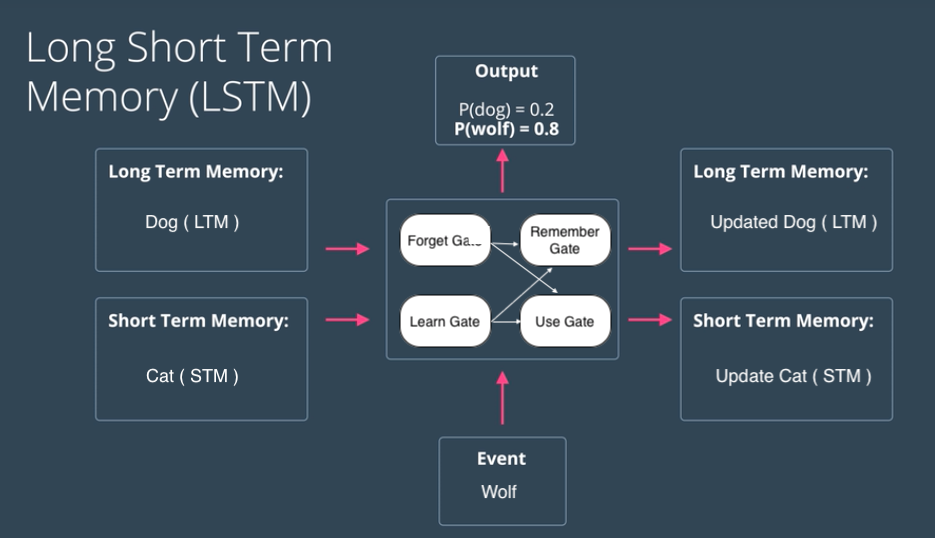
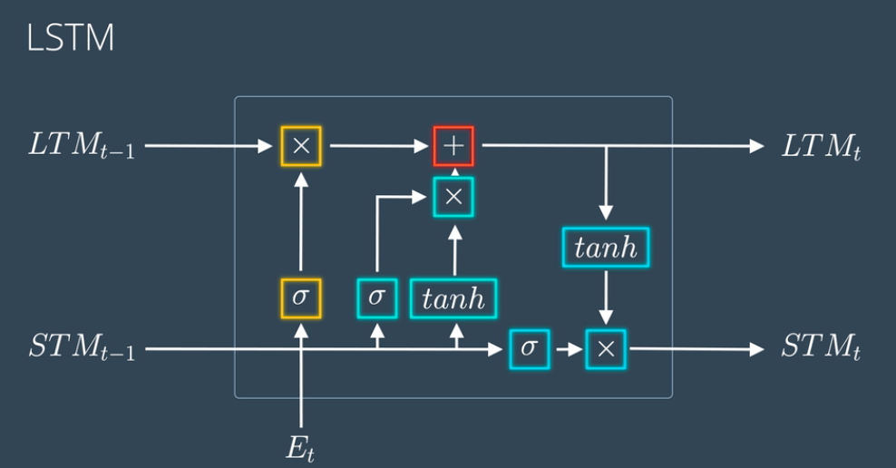
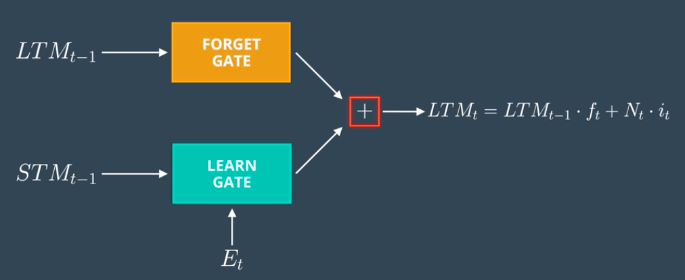
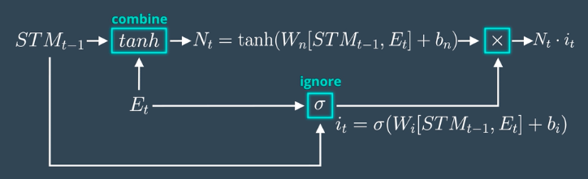
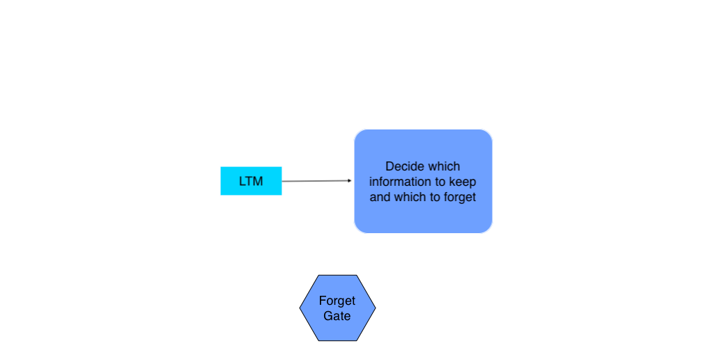
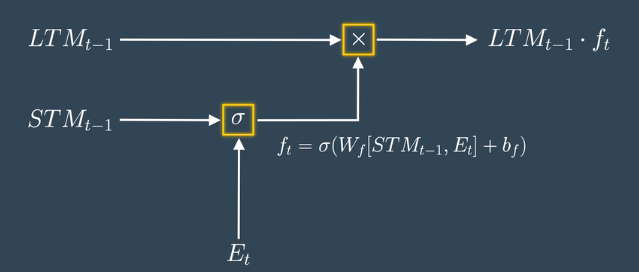
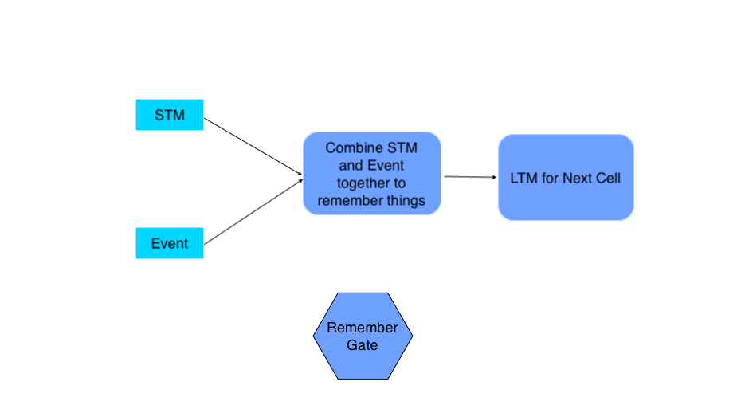
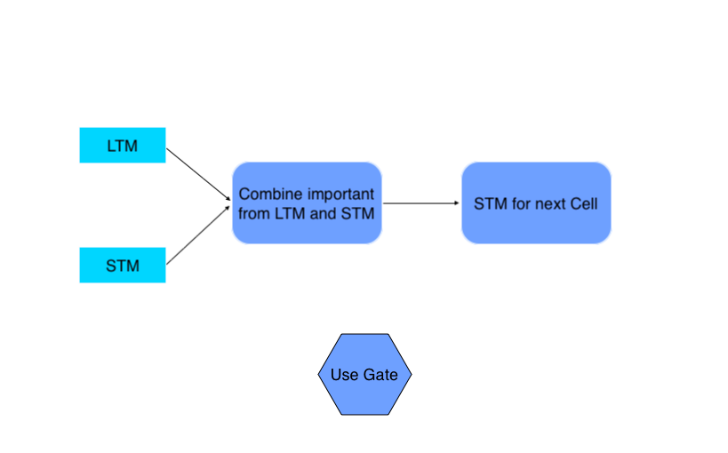
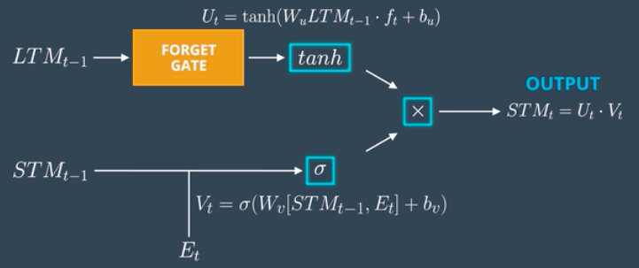

# Understanding Architecture of LSTM

## Introduction

> “Machine intelligence is the last invention that humanity will ever need to make “ — Nick Bostrom

As we have already discussed RNNs in my previous post, it’s time we explore LSTM architecture diagram for long memories. Since LSTM’s work takes previous knowledge into consideration it would be good for you also to have a look at my previous article on [**RNNs**](https://www.analyticsvidhya.com/blog/2020/10/recurrent-neural-networks-for-sequence-learning/) ( relatable right ?).

Let’s take an example, suppose I show you one image and after 2 mins I ask you about that image you will probably remember that image content, but if I ask about the same image some days later, the information might be fade or totally lost right? The first condition is where we need RNNs (for shorter memories) while the other one is when we need the lstm model architecture with its architecture of lstm in deep learning (for long memory capacities). The lstm model architecture is designed to overcome the vanishing gradient problem faced by traditional RNNs, allowing it to learn long-range dependencies more effectively. This clears some doubts right?

For more clarification let’s take another one, suppose you are watching a movie without knowing its name ( e.g. Justice League ) in one frame you See Ban Affleck and think this might be The Batman Movie, in another frame you see Gal Gadot and think this can be Wonder Women right? but when seeing a few next frames you can be sure that this is Justice League because you are using knowledge acquired from past frames, this is exactly what LSTMs architecture diagram do, and by using the following mechanisms:

**1\. Forgetting Mechanism:** Forget all scene related information that is not worth remembering.

**2\. Saving Mechanism:** Save information that is important and can help in the future.

Now that we know when to use LSTMs architecture diagram, let’s discuss the basics of it.

Introduction to Deep Learning

Understand Neural-net basics • Forward/backprop, activations & optimizers

## The architecture of LSTM

LSTMs architecture deal with both Long Term Memory (LTM) and Short Term Memory (STM) and for making the calculations simple and effective it uses the concept of gates.

- **Forget Gate:** LTM goes to forget gate and it forgets information that is not useful.
- **Learn Gate:** Event ( current input ) and STM are combined together so that necessary information that we have recently learned from STM can be applied to the current input.
- **Remember Gate:** LTM information that we haven’t forget and STM and Event are combined together in Remember gate which works as updated LTM.
- **Use Gate:** This gate also uses LTM, STM, and Event to predict the output of the current event which works as an updated STM.
  

_Figure: Remember Gate_

The above figure shows the simplified architecture of LSTMs. The actual mathematical architecture of LSTM is represented using the following figure:

_Figure: LSTM architecture diagram_

don’t go haywire with this architecture we will break it down into simpler steps which will make this a piece of cake to grab.

**Also Read: [What is LSTM? Introduction to Long Short-Term Memory](https://www.analyticsvidhya.com/blog/2021/03/introduction-to-long-short-term-memory-lstm/)**

## Breaking Down the Architecture of LSTM

#### 1\. Learn Gate

Takes Event ( Et ) and Previous Short Term Memory ( STMt-1 ) as input and keeps only relevant information for prediction.

##### Calculation

- The model joins the Previous Short Term Memory STMt-1 and the Current Event vector Et together \[STMt-1, Et\], multiplies the joined vector with the weight matrix Wn, adds some bias to the result, passes it through the tanh (hyperbolic tangent) function to introduce non-linearity, and finally creates a matrix Nt.
- For ignoring insignificant information we calculate one Ignore Factor it, for which we join Short Term Memory STMt-1 and Current Event vector Et and multiply with weight matrix Wi and passed through Sigmoid activation function with some bias.
- Learn Matrix Nt and Ignore Factor it is multiplied together to produce learn gate result.

#### 2\. The Forget Gate

Takes Previous Long Term Memory ( LTMt-1 ) as input and decides on which information should be kept and which to forget.

_Figure: Forget Gate_

##### Calculation

- The model joins the Previous Short Term Memory STMt-1 and the Current Event vector Et together \[STMt-1, Et\], multiplies them with the weight matrix Wf, and passes the result through the Sigmoid activation function with some bias to form the Forget Factor ft.
- The model multiplies the Forget Factor ft with the Previous Long Term Memory (LTMt-1) to produce the forget gate output.

#### 3\. The Remember Gate

Combine Previous Short Term Memory (STMt-1) and Current Event (Et) to produce output.

_Figure: Remember Gate_

##### Calculation

- The output of Forget Gate and Learn Gate are added together to produce an output of Remember Gate which would be LTM for the next cell.

#### 4\. The Use Gate

Combine important information from Previous Long Term Memory and Previous Short Term Memory to create STM for next and cell and produce output for the current event.

##### Calculation

- The model passes the Previous Long Term Memory (LTM-1) through the Tangent activation function with some bias to produce Ut.
- The model joins the Previous Short Term Memory (STMt-1) and the Current Event (Et) together and passes them through the Sigmoid activation function with some bias to produce Vt.
- The model multiplies the Output Ut and Vt together to produce the output of the use gate, which also serves as the STM for the next cell.

Now scroll up to the architecture and put all these calculations so that you will have your LSTM architecture ready.

**Also Read: [Essentials of Deep Learning : Introduction to Long Short Term Memory](https://www.analyticsvidhya.com/blog/2017/12/fundamentals-of-deep-learning-introduction-to-lstm/)**

## Usage of LSTMs

Training LSTMs with their lstm model architecture removes the vanishing gradient problem but faces the exploding gradient issue. The vanishing gradient causes weights to become too small, underfitting the model. The exploding gradient makes weights too large, overfitting the model.

LSTMs can be trained using Python frameworks like TensorFlow, PyTorch, and Theano. However, training deeper LSTM networks with the architecture of lstm in deep learning requires GPU hardware, similar to RNNs.

The lstm model architecture enables LSTMs to handle long-term dependencies effectively. This makes them widely used for language generation, voice recognition, image OCR, and other tasks leveraging the lstm model architecture. Additionally, the architecture of lstm in deep learning is gaining traction in object detection, especially scene text detection.

## Conclusion

In essence, LSTMs epitomize machine intelligence’s pinnacle, embodying Nick Bostrom’s notion of humanity’s ultimate invention. Their lstm model architecture, governed by gates managing memory flow, allows long-term information retention and utilization. The architecture of lstm in deep learning overcomes vanishing gradient challenges faced by traditional models.

LSTMs find crucial applications in language generation, voice recognition, and image OCR tasks. Their expanding role in object detection heralds a new era of AI innovation. Both the lstm model architecture and architecture of lstm in deep learning enable these capabilities. Despite being complex, LSTMs represent a significant advancement in deep learning models.
