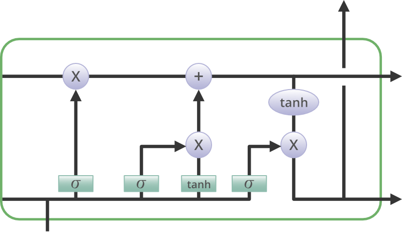
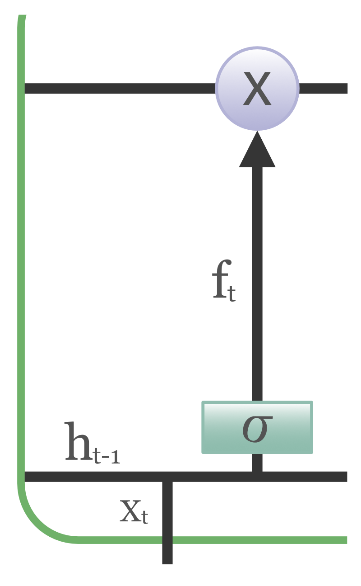
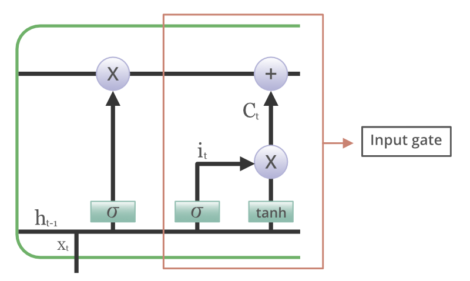
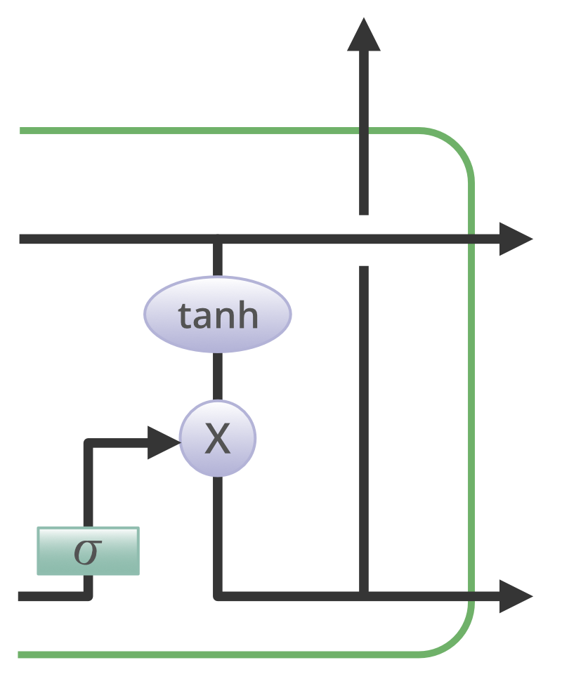
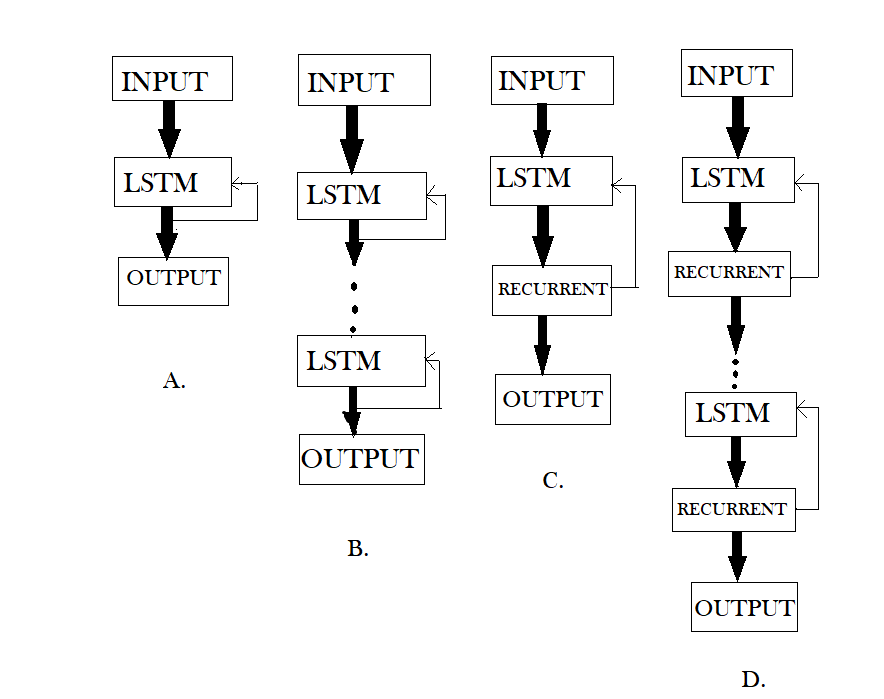
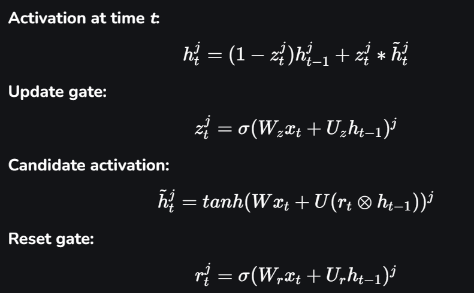

# Understanding of LSTM Networks

This article talks about the problems of conventional RNNs, namely, the vanishing and exploding gradients, and provides a convenient solution to these problems in the form of Long Short Term Memory (LSTM). Long Short-Term Memory is an advanced version of recurrent neural network (RNN) architecture that was designed to model chronological sequences and their long-range dependencies more precisely than conventional RNNs.

## **Introduction to LSTM**

LSTM networks are an extension of recurrent neural networks ([RNNs](https://www.geeksforgeeks.org/machine-learning/introduction-to-recurrent-neural-network/)) mainly introduced to handle situations where RNNs fail.

- It fails to store information for a longer period of time. At times, a reference to certain information stored quite a long time ago is required to predict the current output. But RNNs are absolutely incapable of handling such “long-term dependencies”.
- There is no finer control over which part of the context needs to be carried forward and how much of the past needs to be ‘forgotten’.
- Other issues with RNNs are exploding and vanishing gradients (explained later) which occur during the training process of a network through backtracking.

Thus, Long Short-Term Memory ([LSTM](https://www.geeksforgeeks.org/machine-learning/long-short-term-memory-networks-explanation/)) was brought into the picture. It has been so designed that the vanishing gradient problem is almost completely removed, while the training model is left unaltered. Long-time lags in certain problems are bridged using LSTMs which also handle noise, distributed representations, and continuous values. With LSTMs, there is no need to keep a finite number of states from beforehand as required in the hidden [Markov model](https://www.geeksforgeeks.org/machine-learning/hidden-markov-model-in-machine-learning/) (HMM). LSTMs provide us with a large range of parameters such as learning rates, and input and output biases.

## Structure of LSTM

The basic difference between the architectures of RNNs and LSTMs is that the hidden layer of LSTM is a gated unit or gated cell. It consists of four layers that interact with one another in a way to produce the output of that cell along with the cell state. These two things are then passed onto the next hidden layer. Unlike RNNs which have got only a single neural net layer of tanh, LSTMs comprise three logistic sigmoid gates and one tanh layer. Gates have been introduced in order to limit the information that is passed through the cell. They determine which part of the information will be needed by the next cell and which part is to be discarded. The output is usually in the range of 0-1 where ‘0’ means ‘reject all’ and ‘1’ means ‘include all’.

**Structure of an LSTM Network**

Information is retained by the cells and the memory manipulations are done by the gates. There are three gates which are explained below:

### Forget Gate

The information that is no longer useful in the cell state is removed with the forget gate. Two inputs x_t (input at the particular time) and h_t-1 (previous cell output) are fed to the gate and multiplied with weight matrices followed by the addition of bias. The resultant is passed through an activation function which gives a binary output. If for a particular cell state, the output is 0, the piece of information is forgotten and for output 1, the information is retained for future use.

**Forget Gate in LSTM Cell**

### Input gate

The addition of useful information to the cell state is done by the input gate. First, the information is regulated using the sigmoid function and filter the values to be remembered similar to the forget gate using inputs h_t-1 and x_t. Then, a vector is created using the tanh function that gives an output from -1 to +1, which contains all the possible values from h_t-1 and x_t. At last, the values of the vector and the regulated values are multiplied to obtain useful information.

**Input gate in the LSTM cell**

### Output gate

The task of extracting useful information from the current cell state to be presented as output is done by the output gate. First, a vector is generated by applying the tanh function on the cell. Then, the information is regulated using the [sigmoid function](https://www.geeksforgeeks.org/machine-learning/types-of-activation-function-in-ann/) and filtered by the values to be remembered using inputs h_t-1 and x_t. At last, the values of the vector and the regulated values are multiplied to be sent as an output and input to the next cell.

_Output gate in the LSTM cell_

## **Variations in LSTM Networks** 

With the increasing popularity of LSTMs, various alterations have been tried on the conventional LSTM architecture to simplify the internal design of cells to make them work in a more efficient way and to reduce computational complexity. Gers and Schmidhuber introduced peephole connections which allowed gate layers to have knowledge about the cell state at every instant. Some LSTMs also made use of a coupled input and forget gate instead of two separate gates which helped in making both decisions simultaneously. Another variation was the use of the Gated Recurrent Unit(GRU) which improved the design complexity by reducing the number of gates. It uses a combination of the cell state and hidden state and also an update gate which has forgotten and input gates merged into it.

**LSTM(Figure-A), DLSTM(Figure-B), LSTMP(Figure-C) and DLSTMP(Figure-D)**

1.  Figure-A represents what a basic LSTM network looks like. Only one layer of LSTM between an input and output layer has been shown here.
2.  Figure B represents Deep LSTM which includes a number of LSTM layers in between the input and output. The advantage is that the input values fed to the network not only go through several LSTM layers but also propagate through time within one LSTM cell. Hence, parameters are well distributed within multiple layers. This results in a thorough process of inputs in each time step.
3.  Figure C represents LSTM with the Recurrent Projection layer where the recurrent connections are taken from the projection layer to the LSTM layer input. This architecture was designed to reduce the high learning computational complexity (O(N)) for each time step) of the standard LSTM RNN.
4.  Figure D represents Deep LSTM with a Recurrent Projection Layer consisting of multiple LSTM layers where each layer has its own projection layer. The increased depth is quite useful in the case where the memory size is too large. Having increased depth prevents overfitting in models as the inputs to the network need to go through many nonlinear functions.

## **GRU v/s LSTM**

In spite of being quite similar to LSTMs, [GRUs](https://www.geeksforgeeks.org/machine-learning/gated-recurrent-unit-networks/) have never been so popular. But what are GRUs? GRU stands for Gated Recurrent Units. As the name suggests, these recurrent units, proposed by Cho, are also provided with a gated mechanism to effectively and adaptively capture dependencies of different time scales. They have an update gate and a reset gate. The former is responsible for selecting what piece of knowledge is to be carried forward, whereas the latter lies in between two successive recurrent units and decides how much information needs to be forgotten.

<!--
**Activation at time** **\*t**\_**:**

htj\=(1−ztj)ht−1j+ztj∗h˜tj   h_t^j = (1 - z_t^j)h\_{t-1}^j + z_t^j\*\\~h_t^j   htj​\=(1−ztj​)ht−1j​+ztj​∗h˜tj​

**Update gate:**

ztj\=σ(Wzxt+Uzht−1)j   z_t^j = \\sigma(W_zx_t + U_zh\_{t-1})^j   ztj​\=σ(Wz​xt​+Uz​ht−1​)j

**Candidate activation:**

h˜tj\=tanh(Wxt+U(rt⊗ht−1))j   \\~h_t^j = tanh(Wx_t + U(r_t \\otimes h\_{t-1}))^j   h˜tj​\=tanh(Wxt​+U(rt​⊗ht−1​))j

**Reset gate:**

rtj\=σ(Wrxt+Urht−1)j   r_t^j = \\sigma(W_rx_t + U_rh\_{t-1})^j   rtj​\=σ(Wr​xt​+Ur​ht−1​)j

-->

Another striking aspect of GRUs is that they do not store cell state in any way, hence, they are unable to regulate the amount of memory content to which the next unit is exposed. Instead, LSTMs regulate the amount of new information being included in the cell. On the other hand, the GRU controls the information flow from the previous activation when computing the new, candidate activation, but does not independently control the amount of the candidate activation being added (the control is tied via the update gate).

## **Applications of LSTM Networks** 

LSTM models need to be trained with a training dataset prior to their employment in real-world applications. Some of the most demanding applications are discussed below:

1.  [Language modeling](https://www.geeksforgeeks.org/nlp/n-gram-language-modelling-with-nltk/) or text generation, involves the computation of words when a sequence of words is fed as input. Language models can be operated at the character level, n-gram level, sentence level, or even paragraph level.
2.  Image processing involves performing an analysis of a picture and concluding its result into a sentence. For this, it’s required to have a dataset comprising a good amount of pictures with their corresponding descriptive captions. A model that has already been trained is used to predict features of images present in the dataset. This is photo data. The dataset is then processed in such a way that only the words that are most suggestive are present in it. This is text data. Using these two types of data, we try to fit the model. The work of the model is to generate a descriptive sentence for the picture one word at a time by taking input words that were predicted previously by the model and also the image.
3.  Speech and Handwriting Recognition.
4.  Music generation is quite similar to that of text generation where LSTMs predict musical notes instead of text by analyzing a combination of given notes fed as input.
5.  [Language Translation](https://www.geeksforgeeks.org/machine-learning/translation-and-natural-language-processing-using-google-cloud/) involves mapping a sequence in one language to a sequence in another language. Similar to image processing, a dataset, containing phrases and their translations, is first cleaned and only a part of it is used to train the model. An encoder-decoder LSTM model is used which first converts the input sequence to its vector representation (encoding) and then outputs it to its translated version.

## **Drawbacks of Using LSTM Networks**

As it is said, everything in this world comes with its own advantages and disadvantages, LSTMs too, have a few drawbacks which are discussed below:

1.  LSTMs became popular because they could solve the problem of vanishing gradients. But it turns out, they fail to remove it completely. The problem lies in the fact that the data still has to move from cell to cell for its evaluation. Moreover, the cell has become quite complex now with additional features (such as forget gates) being brought into the picture.
2.  They require a lot of resources and time to get trained and become ready for real-world applications. In technical terms, they need high memory bandwidth because of the linear layers present in each cell which the system usually fails to provide. Thus, hardware-wise, LSTMs become quite inefficient.
3.  With the rise of data mining, developers are looking for a model that can remember past information for a longer time than LSTMs. The source of inspiration for such kind of model is the human habit of dividing a given piece of information into small parts for easy remembrance.
4.  LSTMs get affected by different random weight initialization and hence behave quite similarly to that of a feed-forward neural net. They prefer small-weight initialization instead.
5.  LSTMs are prone to overfitting and it is difficult to apply the dropout algorithm to curb this issue. Dropout is a regularization method where input and recurrent connections to LSTM units are probabilistically excluded from activation and weight updates while training a network.
