# Fundamentals of RNN forward Propagation in Deep Learning

_14 min read_

Let me open this article with a question – “working love learning we on deep”, did this make any sense to you? Not really – read this one – “We love working on deep learning”. Made perfect sense! A little jumble in the words made the sentence incoherent. Well, can we expect a neural network to make sense out of it? Not really! If the human brain was confused on what it meant I am sure a neural network is going to have a tough time deciphering such text.

There are multiple such tasks in everyday life which get completely disrupted when their sequence is disturbed. For instance, language as we saw earlier- the sequence of words define their meaning, a time series data – where time defines the occurrence of events, the data of a genome sequence- where every sequence has a different meaning. There are multiple such cases wherein the sequence of information determines the event itself. If we are trying to use such data for any reasonable output, we need a network which has access to some prior knowledge about the data to completely understand it. Recurrent neural networks thus come into play.

In this article, we will explore RNN forward propagation and its significance in deep learning. We will provide an RNN forward propagation example using Python, demonstrating how data flows through the network to produce meaningful outputs. Understanding this process is crucial for effectively implementing RNNs in various applications.

## Need for a Neural Network dealing with Sequences

Before we deep dive into the details of what a recurrent neural network is, let’s ponder a bit on if we really need a network specially for dealing with sequences in information. Also what are kind of tasks that we can achieve using such networks.

The beauty of recurrent [neural networks](https://www.analyticsvidhya.com/blog/2020/07/neural-networks-from-scratch-in-python-and-r/) lies in their diversity of application. When we are dealing with RNNs they have a great ability to deal with various input and output types.

- **Sentiment Classification** – This can be a task of simply classifying tweets into positive and negative sentiment. So here the input would be a tweet of varying lengths, while output is of a fixed type and size.
- **Image Captioning** – Here, let’s say we have an image for which we need a textual description. So we have a single input – the image, and a series or sequence of words as output. Here the image might be of a fixed size, but the output is a description of varying lengths

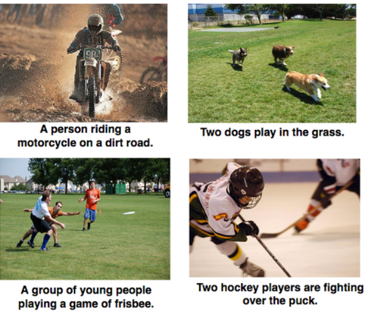

- **Language Translation** – This basically means that we have some text in a particular language let’s say English, and we wish to translate it in French. Each language has it’s own semantics and would have varying lengths for the same sentence. So here the inputs as well as outputs are of varying lengths.


So RNNs can be used for mapping inputs to outputs of varying types, lengths and are fairly generalized in their application. Looking at their applications, let’s see how the architecture of an RNN looks like.

## What are Recurrent Neural Networks?

Let’s say the task is to predict the next word in a sentence. Let’s try accomplishing it using an MLP. So what happens in an [MLP](https://www.analyticsvidhya.com/blog/2022/10/multi-layer-perceptrons-notations-and-trainable-parameters/). In the simplest form, we have an input layer, a hidden layer and an output layer. The input layer receives the input, the hidden layer activations are applied and then we finally receive the output.

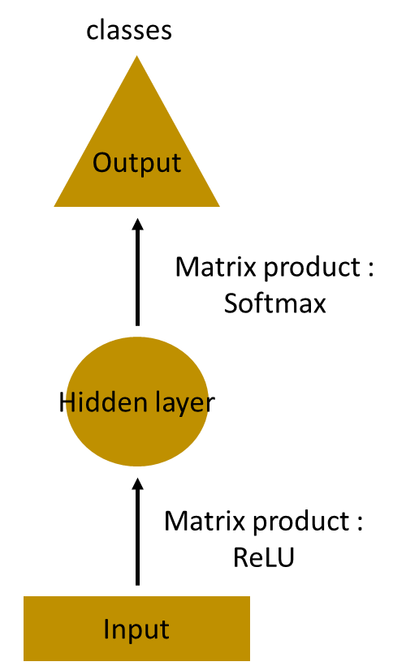

Let’s have a deeper network, where multiple hidden layers are present. So here, the input layer receives the input, the first hidden layer activations are applied and then these activations are sent to the next hidden layer, and successive activations through the layers to produce the output. Each hidden layer is characterized by its own weights and biases.

Since each hidden layer has its own weights and activations, they behave independently. Now the objective is to identify the relationship between successive inputs. Can we supply the inputs to hidden layers? Yes we can!


Here, the weights and bias of these hidden layers are different. And hence each of these layers behave independently and cannot be combined together. To combine these hidden layers together, we shall have the same weights and bias for these hidden layers.
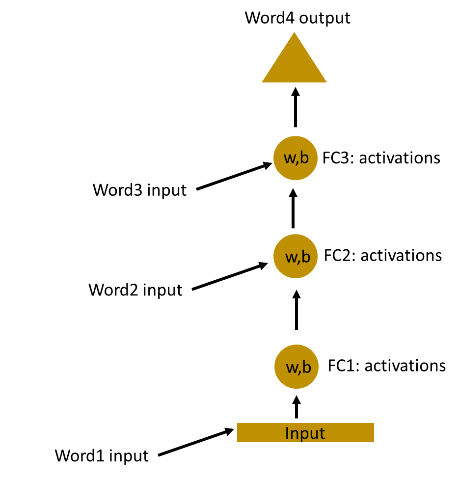

We can now combines these layers together, that the weights and bias of all the hidden layers is the same. All these hidden layers can be rolled in together in a single recurrent layer.

---

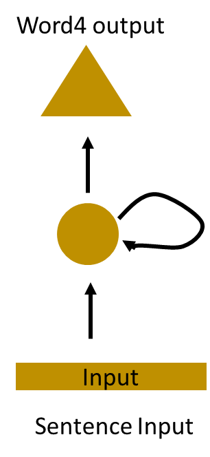

---

So it’s like supplying the input to the hidden layer. At all the time steps weights of the recurrent neuron would be the same since its a single neuron now. So a recurrent neuron stores the state of a previous input and combines with the current input thereby preserving some relationship of the current input with the previous input.

## Understanding a Recurrent Neuron in Detail

Let’s take a simple task at first. Let’s take a character level RNN where we have a word “Hello”. So we provide the first 4 letters i.e. h,e,l,l and ask the network to predict the last letter i.e.’o’. So here the vocabulary of the task is just 4 letters {h,e,l,o}. In real case scenarios involving natural language processing, the vocabularies include the words in entire wikipedia database, or all the words in a language. Here for simplicity we have taken a very small set of vocabulary.

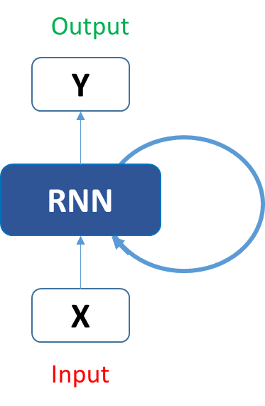

Let’s see how the above structure be used to predict the fifth letter in the word “hello”. In the above structure, the blue RNN block, applies something called as a recurrence formula to the input vector and also its previous state. In this case, the letter “h” has nothing preceding it, let’s take the letter “e”. So at the time the letter “e” is supplied to the network, a recurrence formula is applied to the letter “e” and the previous state which is the letter “h”. These are known as various time steps of the input. So if at time t, the input is “e”, at time t-1, the input was “h”. The recurrence formula is applied to e and h both. and we get a new state.

The formula for the current state can be written as –

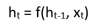

Here, Ht is the new state, ht-1 is the previous state while xt is the current input. We now have a state of the previous input instead of the input itself, because the input neuron would have applied the transformations on our previous input. So each successive input is called as a time step.

In this case we have four inputs to be given to the network, during a recurrence formula, the same function and the same weights are applied to the network at each time step.

Taking the simplest form of a recurrent neural network, let’s say that the activation function is tanh, the weight at the recurrent neuron is Whh and the weight at the input neuron is Wxh, we can write the equation for the state at time t as –


The Recurrent neuron in this case is just taking the immediate previous state into consideration. For longer sequences the equation can involve multiple such states. Once the final state is calculated we can go on to produce the output

Now, once the current state is calculated we can calculate the output state as-

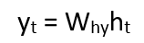

Let me summarize the steps in a recurrent neuron for you-

1.  A single time step of the input is supplied to the network i.e. xt is supplied to the network
2.  We then calculate its current state using a combination of the current input and the previous state i.e. we calculate ht
3.  The current ht becomes ht-1 for the next time step
4.  We can go as many time steps as the problem demands and combine the information from all the previous states
5.  Once all the time steps are completed the final current state is used to calculate the output yt
6.  The output is then compared to the actual output and the error is generated
7.  The error is then backpropagated to the network to update the weights(we shall go into the details of backpropagation in further sections) and the network is trained

Let’s take a look of how we can calculate these states in Excel and get the output.

## Forward Propagation in a Recurrent Neuron in Excel

Let’s take a look at the inputs first –
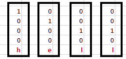

The inputs are one hot encoded. Our entire vocabulary is {h,e,l,o} and hence we can easily one hot encode the inputs.

Now the input neuron would transform the input to the hidden state using the weight wxh. We have randomly initialized the weights as a 3\*4 matrix –

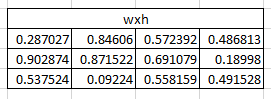
**Step 1:**

Now for the letter “h”, for the the hidden state we would need Wxh\*Xt. By matrix multiplication, we get it as –

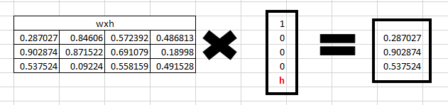

**Step 2:**  
Now moving to the recurrent neuron, we have Whh as the weight which is a 1\*1 matrix as 
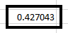

and the bias which is also a 1\*1 matrix as

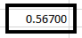

For the letter “h”, the previous state is \[0,0,0\] since there is no letter prior to it.

So to calculate ->  (whh\*ht-1+bias)

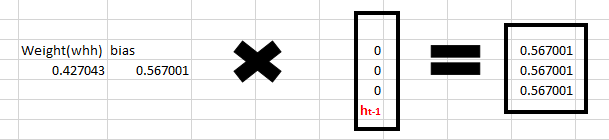

**Step 3:**

Now we can get the current state as –
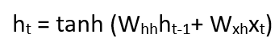

Since for h, there is no previous hidden state we apply the tanh function to this output and get the current state –
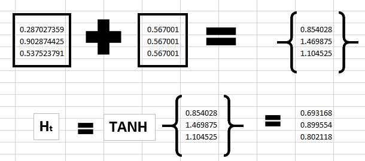

**Step 4:**

Now we go on to the next state. “e” is now supplied to the network. The processed output of ht, now becomes ht-1, while the one hot encoded e, is xt. Let’s now calculate the current state ht.


Whh\*ht-1 +bias will be –

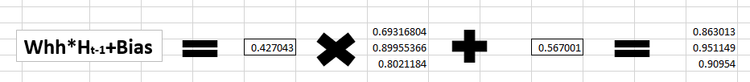

Wxh\*xt will be –

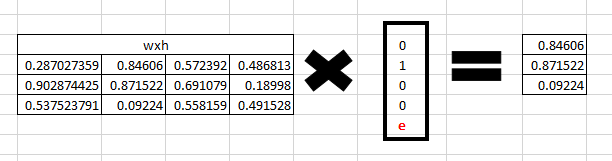

**Step 5:**

Now calculating ht for the letter “e”,

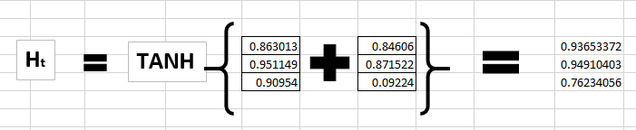

Now this would become ht-1 for the next state and the recurrent neuron would use this along with the new character to predict the next one.

**Step 6:**

At each state, the recurrent neural network would produce the output as well. Let’s calculate yt for the letter e.


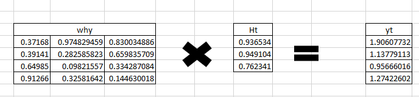

**Step 7:**

The probability for a particular letter from the vocabulary can be calculated by applying the softmax function. so we shall have softmax(yt)

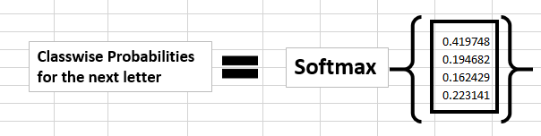

If we convert these probabilities to understand the prediction, we see that the model says that the letter after “e” should be h, since the highest probability is for the letter “h”. Does this mean we have done something wrong? No, so here we have hardly trained the network. We have just shown it two letters. So it pretty much hasn’t learnt anything yet.

Now the next BIG question that faces us is how does Back propagation work in case of a Recurrent Neural Network. How are the weights updated while there is a feedback loop?

## Back propagation in a Recurrent Neural Network(BPTT)

To imagine how weights would be updated in case of a recurrent neural network, might be a bit of a challenge. So to understand and visualize the back propagation, let’s unroll the network at all the time steps. In an RNN we may or may not have outputs at each time step.

In case of a [forward propagation](https://www.analyticsvidhya.com/blog/2021/03/forward-propagation-and-errors-in-a-neural-netwrok/), the inputs enter and move forward at each time step. In case of a backward propagation in this case, we are figuratively going back in time to change the weights, hence we call it the Back propagation through time(BPTT).

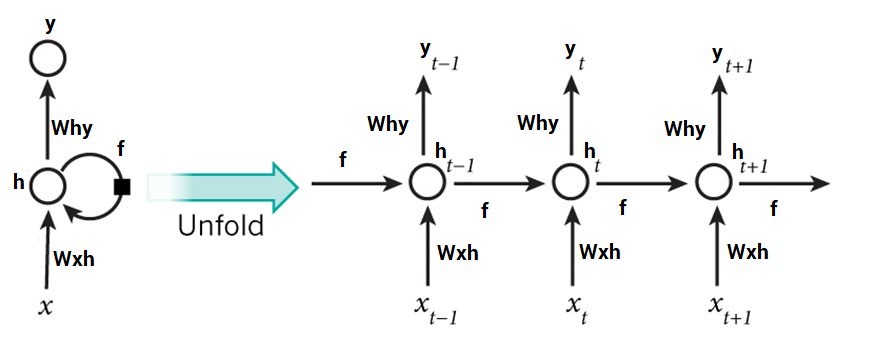

In case of an RNN, if yt is the predicted value ȳt is the actual value, the error is calculated as a cross entropy loss –

Et(ȳt,yt) = – ȳt log(yt)

E(ȳ,y) = – ∑ ȳt log(yt)

We typically treat the full sequence (word) as one training example, so the total error is just the sum of the errors at each time step (character). The weights as we can see are the same at each time step. Let’s summarize the steps for backpropagation

1.  The [cross entropy](https://www.analyticsvidhya.com/blog/2021/03/binary-cross-entropy-log-loss-for-binary-classification/) error is first computed using the current output and the actual output
2.  Remember that the network is unrolled for all the time steps
3.  For the unrolled network, the gradient is calculated for each time step with respect to the weight parameter
4.  Now that the weight is the same for all the time steps the gradients can be combined together for all time steps
5.  The weights are then updated for both recurrent neuron and the dense layers

The unrolled network looks much like a regular neural network. And the back propagation algorithm is similar to a regular neural network, just that we combine the gradients of the error for all time steps. Now what do you think might happen, if there are 100s of time steps. This would basically take really long for the network to converge since after unrolling the network becomes really huge.

In case you do not wish to deep dive into the math of backpropagation, all you need to understand is that back propagation through time works similar as it does in a regular neural network once you unroll the recurrent neuron in your network. However, I shall be coming up with a detailed article on Recurrent Neural networks with scratch with would have the detailed mathematics of the backpropagation algorithm in a recurrent neural network.

## Implementation of Recurrent Neural Networks in Keras

Let’s use Recurrent Neural networks to predict the sentiment of various tweets. We would like to predict the tweets as positive or negative. You can download the dataset [github - cs224u](https://github.com/crwong/cs224u-project/tree/master/data/sentiment)

We have around 1600000 tweets to train our network. If you’re not familiar with the basics of NLP, I would strongly urge you to go through this article. We also have another detailed article on word embedding which would also be helpful for you to understand word embeddings in detail.

Let’s now use RNNs to classify various tweets as positive or negative.

```python
# import all libraries
import keras
from keras.models import Sequential
from keras.layers import Dense, Activation, Dropout
from keras.layers.convolutional import Conv1D
from keras.preprocessing.text import Tokenizer
from keras.preprocessing.sequence import pad_sequences
import pandas as pd
import numpy as np
import spacy
nlp=spacy.load("en")

#load the dataset
train=pd.read_csv("../datasets/training.1600000.processed.noemoticon.csv" , encoding= "latin-1")
Y_train = train[train.columns[0]]
X_train = train[train.columns[5]]

# split the data into test and train
from sklearn.model_selection import train_test_split
trainset1x, trainset2x, trainset1y, trainset2y = train_test_split(X_train.values, Y_train.values, test_size=0.02,random_state=42 )
trainset2y=pd.get_dummies(trainset2y)

# function to remove stopwords
def stopwords(sentence):
    new=[]
    sentence=nlp(sentence)
    for w in sentence:
        if (w.is_stop == False) & (w.pos_ !="PUNCT"):
            new.append(w.string.strip())
        c=" ".join(str(x) for x in new)
    return c

# function to lemmatize the tweets
def lemmatize(sentence):
    sentence=nlp(sentence)
    str=""
    for w in sentence:
        str+=" "+w.lemma_
    return nlp(str)

#loading the glove model
def loadGloveModel(gloveFile):
    print("Loading Glove Model")
    f = open(gloveFile,'r')
    model = {}
    for line in f:
        splitLine = line.split()
        word = splitLine[0]
        embedding = [float(val) for val in splitLine[1:]]
        model[word] = embedding
    print ("Done."),len(model),(" words loaded!")
    return model

    # save the glove model
    model=loadGloveModel("/mnt/hdd/datasets/glove/glove.twitter.27B.200d.txt")

#vectorising the sentences
def sent_vectorizer(sent, model):
    sent_vec = np.zeros(200)
    numw = 0
    for w in sent.split():
        try:
            sent_vec = np.add(sent_vec, model[str(w)])
            numw+=1
        except:
            pass
    return sent_vec

    #obtain a clean vector
    cleanvector=[]
    for i in range(trainset2x.shape[0]):
        document=trainset2x[i]
        document=document.lower()
        document=lemmatize(document)
        document=str(document)
        cleanvector.append(sent_vectorizer(document,model))

        #Getting the input and output in proper shape
        cleanvector=np.array(cleanvector)
        cleanvector =cleanvector.reshape(len(cleanvector),200,1)

    #tokenizing the sequences
    tokenizer = Tokenizer(num_words=16000)
    tokenizer.fit_on_texts(trainset2x)
    sequences = tokenizer.texts_to_sequences(trainset2x)
    word_index = tokenizer.word_index
    print('Found %s unique tokens.' % len(word_index))
    data = pad_sequences(sequences, maxlen=15, padding="post")
    print(data.shape)

    #reshape the data and preparing to train
    data=data.reshape(len(cleanvector),15,1)
    from sklearn.model_selection import train_test_split
    trainx, validx, trainy, validy = train_test_split(data, trainset2y, test_size=0.3,random_state=42 )

    #calculate the number of words
    nb_words=len(tokenizer.word_index)+1

    #obtain theembedding matrix
    embedding_matrix = np.zeros((nb_words, 200))
    for word, i in word_index.items():
    embedding_vector = model.get(word)
    if embedding_vector is not None:
    embedding_matrix\[i\] = embedding_vector
    print('Null word embeddings: %d' % np.sum(np.sum(embedding_matrix, axis=1) == 0))

    trainy=np.array(trainy)
    validy=np.array(validy)

#building a simple RNN model
def modelbuild():
    model = Sequential()
    model.add(keras.layers.InputLayer(input_shape=(15,1)))
    keras.layers.embeddings.Embedding(nb_words, 15, weights=\[embedding_matrix\], input_length=15,
    trainable=False)

        model.add(keras.layers.recurrent.SimpleRNN(units = 100, activation='relu',
        use\_bias=True))

    model.add(keras.layers.Dense(units=1000, input_dim = 2000, activation='sigmoid'))
        model.add(keras.layers.Dense(units=500, input_dim=1000, activation='relu'))
        model.add(keras.layers.Dense(units=2, input_dim=500,activation='softmax'))
        model.compile(loss='categorical_crossentropy', optimizer='adam', metrics=\['accuracy'\])
    return model

#compiling the model
finalmodel = modelbuild()
finalmodel.fit(trainx, trainy, epochs=10, batch_size=120,validation_data=(validx,validy))
```

If  you would run this model, it may not provide you with the best results since this is an extremely simple architecture and quite a shallow network.  I would strongly urge you to play with the architecture of the network to obtain better results. Also, there are multiple approaches to how to preprocess your data. Preprocessing shall completely depend on the task at hand.

## Vanishing and Exploding Gradient Problem

RNNs work upon the fact that the result of an information is dependent on its previous state or previous n time steps. Regular RNNs might have a difficulty in learning long range dependencies. For instance if we have a sentence like “The man who ate my pizza has purple hair”. In this case, the description purple hair is for the man and not the pizza. So this is a long dependency.

If we backpropagate the error in this case, we would need to apply the chain rule. To calculate the error after the third time step with respect to the first one –

∂E/∂W = ∂E/∂y3 \*∂y3/∂h3 \*∂h3/∂y2 \*∂y2/∂h1 .. and there is a long dependency.

Here we apply the chain rule and if any one of the gradients approached 0, all the gradients would rush to zero exponentially fast due to the multiplication. Such states would no longer help the network to learn anything. This is known as the vanishing gradient problem.

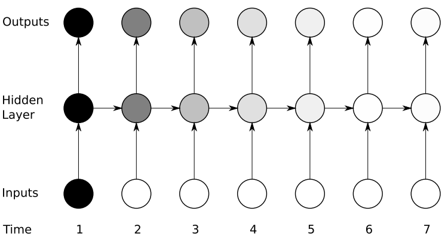

[Vanishing gradient](https://www.analyticsvidhya.com/blog/2021/06/the-challenge-of-vanishing-exploding-gradients-in-deep-neural-networks/) problem is far more threatening as compared to the exploding gradient problem, where the gradients become very very large due to a single or multiple gradient values becoming very high.

The reason why Vanishing gradient problem is more concerning is that an exploding gradient problem can be easily solved by clipping the gradients at a predefined threshold value. Fortunately there are ways to handle vanishing gradient problem as well. There are architectures like the LSTM(Long Short term memory) and the GRU(Gated Recurrent Units) which can be used to deal with the vanishing gradient problem.

## Other RNN architectures

As we saw, RNNs suffer from vanishing gradient problems when we ask them to handle long term dependencies. They also become severely difficult to train as the number of parameters become extremely large. If we unroll the network, it becomes so huge that its convergence is a challenge.

Long Short Term Memory networks – usually called “LSTMs” – are a special kind of RNN, capable of learning long-term dependencies. They were introduced by Hochreiter & Schmidhuber. They work tremendously well on a large variety of problems, and are now widely used. LSTMs also have this chain like structure, but the repeating module has a slightly different structure. Instead of having a single neural network layer, there are multiple layers, interacting in a very special way. They have an input gate, a forget gate and an output gate. We shall be coming up with detailed article on LSTMs soon.

Another efficient RNN architecture is the Gated Recurrent Units i.e. the GRUs. They are a variant of LSTMs but are simpler in their structure and are easier to train. Their success is primarily due to the gating network signals that control how the present input and previous memory are used, to update the current activation and produce the current state. These gates have their own sets of weights that are adaptively updated in the learning phase. We have just two gates here, the reset an the update gate. Stay tuned for more detailed articles on GRUs.

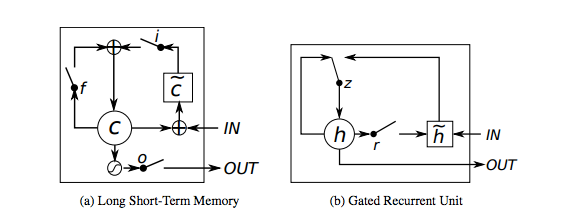

## End Notes

I hope that this article would have given you a head start with the Recurrent Neural Networks.  In the upcoming articles we shall deep dive into the complex mathematics of Recurrent Neural Networks along with the detailed descriptions of [LSTMs](https://www.analyticsvidhya.com/blog/2021/03/introduction-to-long-short-term-memory-lstm/) and GRUs. Try playing with the architecture of these RNNs and be amazed by their performance and applications. Do share your findings and approach in the comments section.

Hope you like this article! Recurrent Neural Networks (RNNs) utilize forward propagation to process sequences, essential in deep learning. An RNN forward propagation example in Python illustrates how data flows through layers, computing outputs based on previous inputs, enhancing tasks like language modeling.
