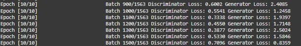

# Generative Adversarial Network (GAN)

Generative Adversarial Networks (GAN) help machines to create new, realistic data by learning from existing examples. It is introduced by Ian Goodfellow and his team in 2014 and they have transformed how computers generate images, videos, music and more. Unlike traditional models that only recognize or classify data, they take a creative way by generating entirely new content that closely resembles real-world data. This ability helped various fields such as art, gaming, healthcare and data science. In this article, we will see more about GANs and its core concepts.


## Architecture of GAN

GAN consist of two main models that work together to create realistic synthetic data which are as follows:

### 1. Generator Model

The generator is a deep neural network that takes random noise as input to generate realistic data samples like images or text. It learns the underlying data patterns by adjusting its internal parameters during training through [backpropagation](https://www.geeksforgeeks.org/machine-learning/backpropagation-in-neural-network/). Its objective is to produce samples that the discriminator classifies as real.

**Generator Loss Function:** The generator tries to minimize this loss:


### 2. Discriminator Model

The discriminator acts as a binary classifier helps in distinguishing between real and generated data. It learns to improve its classification ability through training, refining its parameters to detect fake samples more accurately. When dealing with image data, the discriminator uses convolutional layers or other relevant architectures which help to extract features and enhance the model’s ability.

**Discriminator Loss Function:** The discriminator tries to minimize this loss:


### MinMax Loss

GANs are trained using a [MinMax Loss](https://www.geeksforgeeks.org/dsa/minimax-algorithm-in-game-theory-set-1-introduction/) between the generator and discriminator:


The generator tries to minimize this loss (to fool the discriminator) and the discriminator tries to maximize it (to detect fakes accurately).


GAN

## How does a GAN work?

GAN train by having two networks the Generator (G) and the Discriminator (D) compete and improve together. Here's the step-by-step process

### 1. Generator's First Move

The generator starts with a random noise vector like random numbers. It uses this noise as a starting point to create a fake data sample such as a generated image. The generator’s internal layers transform this noise into something that looks like real data.

### 2. Discriminator's Turn

The discriminator receives two types of data:

- Real samples from the actual training dataset.
- Fake samples created by the generator.

D's job is to analyze each input and find whether it's real data or something G cooked up. It outputs a probability score between 0 and 1. A score of 1 shows the data is likely real and 0 suggests it's fake.

### 3. Adversarial Learning

- If the discriminator correctly classifies real and fake data it gets better at its job.
- If the generator fools the discriminator by creating realistic fake data, it receives a positive update and the discriminator is penalized for making a wrong decision.

### 4. Generator's Improvement

- Each time the discriminator mistakes fake data for real, the generator learns from this success.
- Through many iterations, the generator improves and creates more convincing fake samples.

### 5. Discriminator's Adaptation

- The discriminator also learns continuously by updating itself to better spot fake data.
- This constant back-and-forth makes both networks stronger over time.

### 6. Training Progression

- As training continues, the generator becomes highly proficient at producing realistic data.
- Eventually the discriminator struggles to distinguish real from fake shows that the GAN has reached a well-trained state.
- At this point, the generator can produce high-quality synthetic data that can be used for different applications.

## Types of GAN

There are several types of GANs each designed for different purposes. Here are some important types:

### 1. Vanilla GAN

Vanilla GAN is the simplest type of GAN. It consists of:

- A generator and a discriminator both are built using multi-layer perceptrons (MLPs).
- The model optimizes its mathematical formulation using stochastic gradient descent (SGD).

While foundational, Vanilla GAN can face problems like:

- \***\*Mode collapse\*\***: The generator produces limited types of outputs repeatedly.
- \***\*Unstable training\*\***: The generator and discriminator may not improve smoothly.

### 2. Conditional GAN (CGAN)

Conditional GAN (CGAN) adds an additional conditional parameter to guide the generation process. Instead of generating data randomly they allow the model to produce specific types of outputs.

Working of CGANs:

- A conditional variable (y) is fed into both the generator and the discriminator.
- This ensures that the generator creates data corresponding to the given condition (e.g generating images of specific objects).
- The discriminator also receives the labels to help distinguish between real and fake data.

**Example**: Instead of generating any random image, CGAN can generate a specific object like a dog or a cat based on the label.

### 3. Deep Convolutional GAN (DCGAN)

Deep Convolutional GAN (DCGAN) are among the most popular types of GANs used for image generation.

They are important because they:

- Uses Convolutional Neural Networks (CNNs) instead of simple multi-layer perceptrons (MLPs).
- Max pooling layers are replaced with convolutional stride helps in making the model more efficient.
- Fully connected layers are removed, which allows for better spatial understanding of images.

DCGANs are successful because they generate high-quality, realistic images.

### 4. Laplacian Pyramid GAN (LAPGAN)

Laplacian Pyramid GAN (LAPGAN) is designed to generate ultra-high-quality images by using a multi-resolution approach.

Working of LAPGAN:

- Uses multiple generator-discriminator pairs at different levels of the Laplacian pyramid.
- Images are first down sampled at each layer of the pyramid and upscaled again using Conditional GAN (CGAN).
- This process allows the image to gradually refine details and helps in reducing noise and improving clarity.

Due to its ability to generate highly detailed images, LAPGAN is considered a superior approach for photorealistic image generation.

### 5. Super Resolution GAN (SRGAN)

Super-Resolution GAN (SRGAN) is designed to increase the resolution of low-quality images while preserving details.

Working of SRGAN:

- Uses a deep neural network combined with an adversarial loss function.
- Enhances low-resolution images by adding finer details helps in making them appear sharper and more realistic.
- Helps to reduce common image upscaling errors such as blurriness and pixelation.

## Implementation of Generative Adversarial Network (GAN) using PyTorch

Generative Adversarial Networks (GAN) can generate realistic images by learning from existing image datasets. Here we will be implementing a GAN trained on the CIFAR-10 dataset using PyTorch.

### Step 1: Importing Required Libraries

We will be using `Pytorch`, `Torchvision`, `Matplotlib`and `Numpy`libraries for this. Set the device to GPU if available otherwise use CPU.

```python
import torch
import torch.nn as nn
import torch.optim as optim
import torchvision from torchvision
import datasets, transforms
import matplotlib.pyplot as plt
import numpy as np

device = torch.device('cuda' if torch.cuda.is_available() else 'cpu')`
```

### Step 2: Defining Image Transformations

We use PyTorch’s transforms to convert images to tensors and normalize pixel values between -1 and 1 for better training stability.

```python
transform = transforms.Compose([
         transforms.ToTensor(),
         transforms.Normalize((0.5, 0.5, 0.5), (0.5, 0.5, 0.5))
])`

```

### Step 3: Loading the CIFAR-10 Dataset

Download and load the CIFAR-10 dataset with defined transformations. Use a [DataLoader](https://www.geeksforgeeks.org/deep-learning/pytorch-dataloader/) to process the dataset in mini-batches of size 32 and shuffle the data.

```python
train_dataset = datasets.CIFAR10(root='./data',\
        train=True, download=True, transform=transform)
dataloader = torch.utils.data.DataLoader(train_dataset, \
        batch_size=32, shuffle=True)`
```

### Step 4: Defining GAN Hyperparameters

Set important training parameters:

- **latent_dim** : Dimensionality of the noise vector.
- **lr** : Learning rate of the optimizer.
- **beta1, beta2** : Beta parameters for Adam optimizer (e.g 0.5, 0.999)
- **num_epochs** : Number of times the entire dataset will be processed (e.g 10)

```python
latent_dim = 100
lr = 0.0002
beta1 = 0.5
beta2 = 0.999
num_epochs = 10`
```

### Step 5: Building the Generator

Create a neural network that converts random noise into images. Use transpose convolutional layers, batch normalization and [ReLU](https://www.geeksforgeeks.org/deep-learning/relu-activation-function-in-deep-learning/) activations. The final layer uses [Tanh](https://www.geeksforgeeks.org/deep-learning/tanh-activation-in-neural-network/) activation to scale outputs to the range \[-1, 1\].

- **nn.Linear(latent_dim, 128 \* 8 \* 8)**: Defines a fully connected layer that projects the noise vector into a higher dimensional feature space.
- **nn.Upsample(scale_factor=2)**: Doubles the spatial resolution of the feature maps by upsampling.
- **nn.Conv2d(128, 128, kernel_size=3, padding=1)**: Applies a convolutional layer keeping the number of channels the same to refine features.

```python
class Generator(nn.Module):
    def __init__(self, latent_dim):
        super(Generator, self).__init__()

        self.model = nn.Sequential(
            nn.Linear(latent_dim, 128 * 8 * 8),
            nn.ReLU(),
            nn.Unflatten(1, (128, 8, 8)),
            nn.Upsample(scale_factor=2),
            nn.Conv2d(128, 128, kernel_size=3, padding=1),
            nn.BatchNorm2d(128, momentum=0.78),
            nn.ReLU(),
            nn.Upsample(scale_factor=2),
            nn.Conv2d(128, 64, kernel_size=3, padding=1),
            nn.BatchNorm2d(64, momentum=0.78),
            nn.ReLU(),
            nn.Conv2d(64, 3, kernel_size=3, padding=1),
            nn.Tanh()
        )
    def forward(self, z):
        img = self.model(z)
        return img`

```

### Step 6: Building the Discriminator

Create a binary classifier network that distinguishes real from fake images. Use convolutional layers, batch normalization, dropout, LeakyReLU activation and a Sigmoid output layer to give a probability between 0 and 1.

- **nn.Conv2d(32, 64, kernel_size=3, stride=2, padding=1)**: Second convolutional layer increasing channels to 64, downsampling further.
- **nn.BatchNorm2d(256, momentum=0.8)**: Batch normalization for 256 feature maps with momentum 0.8.

```python
class Discriminator(nn.Module):
    def __init__(self):
        super(Discriminator, self).__init__()

self.model = nn.Sequential(
        nn.Conv2d(3, 32, kernel_size=3, stride=2, padding=1),
    nn.LeakyReLU(0.2),
    nn.Dropout(0.25),
    nn.Conv2d(32, 64, kernel_size=3, stride=2, padding=1),
    nn.ZeroPad2d((0, 1, 0, 1)),
    nn.BatchNorm2d(64, momentum=0.82),
    nn.LeakyReLU(0.25),
    nn.Dropout(0.25),
    nn.Conv2d(64, 128, kernel_size=3, stride=2, padding=1),
    nn.BatchNorm2d(128, momentum=0.82),
    nn.LeakyReLU(0.2),
    nn.Dropout(0.25),
    nn.Conv2d(128, 256, kernel_size=3, stride=1, padding=1),
    nn.BatchNorm2d(256, momentum=0.8),
    nn.LeakyReLU(0.25),
    nn.Dropout(0.25),
    nn.Flatten(),
    nn.Linear(256 * 5 * 5, 1),
    nn.Sigmoid()
)
 def forward(self, img):
        validity = self.model(img)
    return validity`
```

### Step 7: Initializing GAN Components

- **Generator and Discriminator** are initialized on the available device (GPU or CPU).
- **Binary Cross-Entropy (BCE) Loss** is chosen as the loss function.
- **Adam optimizers** are defined separately for the generator and discriminator with specified learning rates and betas.

```python
generator = Generator(latent_dim).to(device)
discriminator = Discriminator().to(device)
adversarial_loss = nn.BCELoss()
optimizer_G = optim.Adam(generator.parameters()\
        , lr=lr, betas=(beta1, beta2))
optimizer_D = optim.Adam(discriminator.parameters()\
        , lr=lr, betas=(beta1, beta2))`
```

### Step 8: Training the GAN

Train the discriminator on real and fake images, then update the generator to improve its fake image quality. Track losses and visualize generated images after each epoch.

- **valid = torch.ones(real_images.size(0), 1, device=device):** Create a tensor of ones representing real labels for the discriminator.
- **fake = torch.zeros(real_images.size(0), 1, device=device):** Create a tensor of zeros representing fake labels for the discriminator.
- **z = torch.randn(real_images.size(0), latent_dim, device=device):** Generate random noise vectors as input for the generator.
- **g_loss = adversarial_loss(discriminator(gen_images), valid):** Calculate generator loss based on the discriminator classifying fake images as real.
- **grid = torchvision.utils.make_grid(generated, nrow=4, normalize=True):** Arrange generated images into a grid for display, normalizing pixel values.

```python
for epoch in range(num_epochs):
    for i, batch in enumerate(dataloader):

        real_images = batch[0].to(device)

        valid = torch.ones(real_images.size(0), 1, device=device)
        fake = torch.zeros(real_images.size(0), 1, device=device)

        real_images = real_images.to(device)

        optimizer_D.zero_grad()

        z = torch.randn(real_images.size(0), latent_dim, device=device)

        fake_images = generator(z)

        real_loss = adversarial_loss(discriminator\
                                     (real_images), valid)
        fake_loss = adversarial_loss(discriminator\
                                     (fake_images.detach()), fake)
        d_loss = (real_loss + fake_loss) / 2

        d_loss.backward()
        optimizer_D.step()

        optimizer_G.zero_grad()

        gen_images = generator(z)

        g_loss = adversarial_loss(discriminator(gen_images), valid)
        g_loss.backward()
        optimizer_G.step()

        if (i + 1) % 100 == 0:
            print(
                f"Epoch [{epoch+1}/{num_epochs}]\
                        Batch {i+1}/{len(dataloader)} "
                f"Discriminator Loss: {d_loss.item():.4f} "
                f"Generator Loss: {g_loss.item():.4f}"
            )
    if (epoch + 1) % 10 == 0:
        with torch.no_grad():
            z = torch.randn(16, latent_dim, device=device)
            generated = generator(z).detach().cpu()
            grid = torchvision.utils.make_grid(generated,\
                                        nrow=4, normalize=True)
            plt.imshow(np.transpose(grid, (1, 2, 0)))
            plt.axis("off")
            plt.show()
```

**Output:**


Training


Output

By following these steps we successfully implemented and trained a GAN that learns to generate realistic CIFAR-10 images through adversarial training.

## Application Of Generative Adversarial Networks (GAN)

1.  **Image Synthesis & Generation:** GANs generate realistic images, avatars and high-resolution visuals by learning patterns from training data. They are used in art, gaming and AI-driven design.
2.  **Image-to-Image Translation:** They can transform images between domains while preserving key features. Examples include converting day images to night, sketches to realistic images or changing artistic styles.
3.  **Text-to-Image Synthesis:** They create visuals from textual descriptions helps applications in AI-generated art, automated design and content creation.
4.  **Data Augmentation:** They generate synthetic data to improve machine learning models helps in making them more robust and generalizable in fields with limited labeled data.
5.  **High-Resolution Image Enhancement:** They upscale low-resolution images which helps in improving clarity for applications like medical imaging, satellite imagery and video enhancement.

## Advantages of GAN

Lets see various advantages of the GANs:

1.  **Synthetic Data Generation:** GANs produce new, synthetic data resembling real data distributions which is useful for augmentation, anomaly detection and creative tasks.
2.  **High-Quality Results**: They can generate photorealistic images, videos, music and other media with high quality.
3.  **Unsupervised Learning**: They don’t require labeled data helps in making them effective in scenarios where labeling is expensive or difficult.
4.  **Versatility**: They can be applied across many tasks including image synthesis, text-to-image generation, style transfer, anomaly detection and more.

GANs are evolving and shaping the future of artificial intelligence. As the technology improves, we can expect even more innovative applications that will change how we create, work and interact with digital content.

[Notebook With Demo](./images_gfg/gan/Generative_Adversarial_Network.ipynb)
