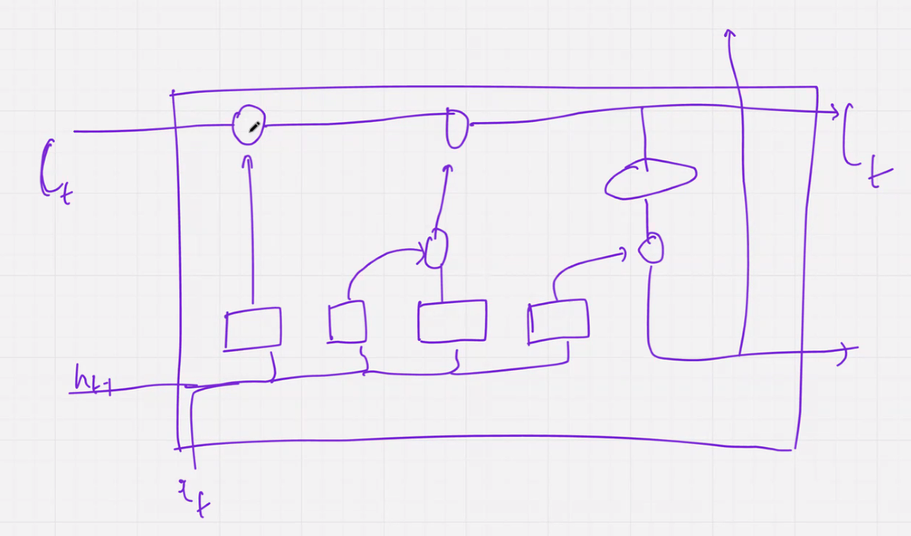
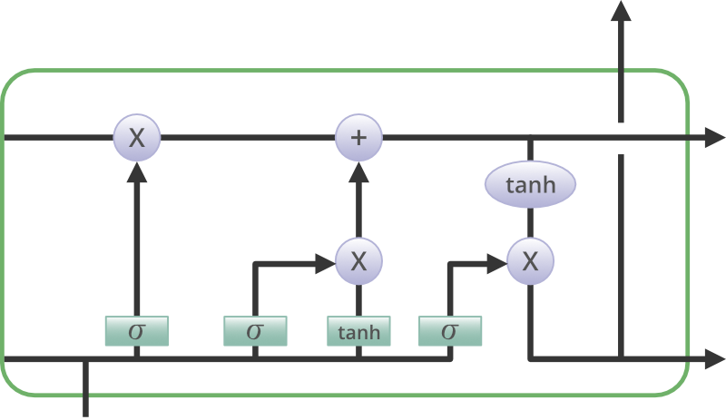

# Lecture 5 : LSTM Introduction

Unlike RNN with one state in LSTM we have two states

1. Cell states
2. Hidden State

We need to know `Gate Concept`

cp -1 ( previvous state) passed to the next state

Exit Gate
or Memory Gate

Erasing Memory function we use `forget Gate`

### Input gate

Control the input going to the Cell State

We have calulated 3 terms

- Forget Term
- Temporary Cell Term
-

Fill in the Blank

LSTM Cell

### Step 3 : Update the cell State

## References

- https://chatgpt.com/c/68989003-7608-8321-b8c4-5aec574ed987
- https://colah.github.io/posts/2015-08-Understanding-LSTMs/
