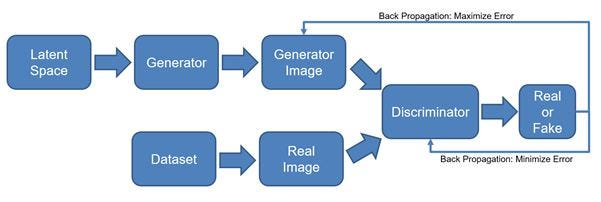

# GenAI fundamentals - GAN

- https://zoom.us/clips/share/E9VyhsRDRluzvrp5iEZKFw
- https://www.perplexity.ai/search/gan-for-image-genration-FWc3GLCvSjWmFBz5HBdb0g

Description
I discussed the fundamentals of text and image generation, focusing on image generation models that can generate realistic images like those from a GAN. I explained that generating images is a two-part problem, involving feature vectors generated by a neural network, specifically a convolutional neural network (CNN). I also mentioned the need for something analogous to embeddings for understanding language, generated by a neural network. I suggested that the audience should go through the provided resources to understand the CNN operation in detail. I then explained the concept of Generative Adversarial Networks (GANs) and how they work, involving two networks, a generator and a discriminator, which interact with each other. I also discussed the use of convolutional neural networks (CNNs) in GANs and the concept of early stopping. Finally, I shared a notebook that can be used to generate images using GANs.

Here is a merged version with only one heading per topic, each keeping its provided time stamp. The content from previous answers is combined and condensed for clarity under unified headings.

---

### Text and Image Generation Fundamentals - 00:00:00

- Image generation involves translating language into machine-readable form using embeddings, similar to how text generation maps words into vectors.[10][11]
- Feature vectors from neural networks (CNNs) provide foundations for both text understanding and realistic image synthesis.[11][10]

### How Convolutional Neural Networks Classify Images - 00:08:00

- CNNs classify images by sliding learned filters over input images, extracting features and compressing visual data into feature vectors for machine interpretation.[12][11]
- Multiple convolution and pooling layers build abstract representations used for image recognition and classification.[10][11]

### Generative Adversarial Networks (GANs) and Components - 00:18:32

- GANs contain a generator (produces fake images) and a discriminator (distinguishes fake from real), trained adversarially to improve the generator’s realism over time.[13][11][12][10]

### Training a Discriminator and Generator in Neural Networks - 00:26:40

- During GAN training, the generator aims to fool the discriminator with synthetic images, while the discriminator learns to better identify fakes, iteratively enhancing both networks.[11][12][13][10]

### GAN Working Mechanism - 00:42:08

- GANs work by a cycle of competition and feedback: generators create data, discriminators evaluate, and both evolve until generated outputs are indistinguishable from real samples.[12][13][11]

### Neural Network Features and Discriminators - 00:53:42

- Feature vectors represent image information for classifiers; GAN discriminators typically use CNNs to assess image authenticity, learning nuanced feature identification.[10][12]

### Utility Function for Layer Types in RNN ELCM Examples - 01:10:00

- Utility functions set layer types such as batch normalization and convolution within models, allowing streamlined customization and experimentation in architectures.[12][10]

### Generating Fake Images With Convolutional Operations - 01:16:59

- Fake image generation passes random vectors through convolutional layers (like encoder blocks in encoder-decoder models) to produce realistic outputs from low-dimensional noise.[11]

### Generator Capabilities After 10 Epochs of Training - 01:27:45

- Well-trained generators after multiple epochs can create dozens of images that visually resemble real data, demonstrating progress and learning effectiveness.[10][11]

### Convolution in Image Processing: Matrix Representation and Filter Application - 01:34:17

- Image convolution applies filters to 2D matrix representations of images, extracting patterns and features by generating transformed matrices that highlight key visual elements.[11][12]

### References

[10](https://www.geeksforgeeks.org/deep-learning/generative-adversarial-network-gan/)
[11](https://www.dhiwise.com/post/generative-adversarial-networks-image-generation)
[12](https://www.carmatec.com/blog/complete-guide-to-generative-adversarial-network-gan/)
[13](https://aws.amazon.com/what-is/gan/)
