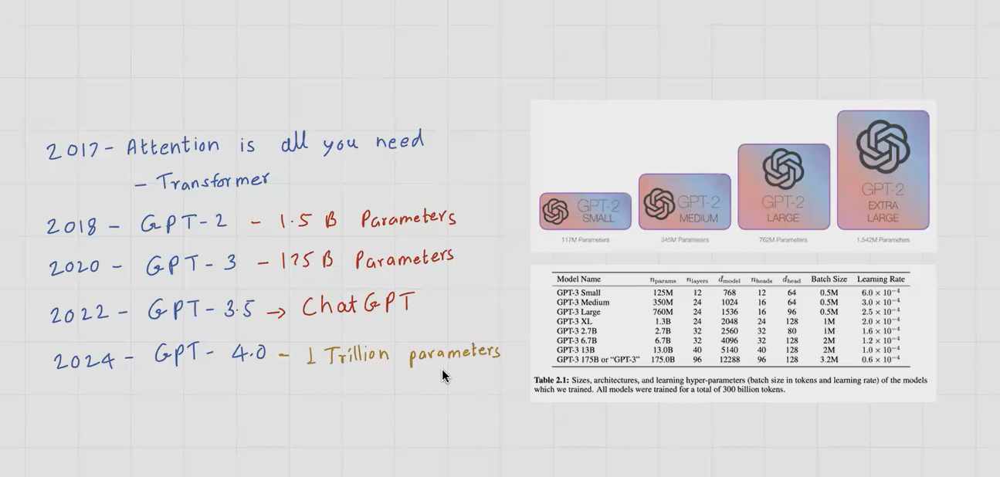

# Lecture 3 - Pretaining + Finetuning

June 2025 - Build LLM from scratch - Lecture 3 - Pretaining + Finetuning

### Key Takeaways From Previous Large Language Model Sessions (00:00:00)

- The key takeaways from the previous sessions on large language models.

### Scaling Law for Natural Language Models (00:06:39)

- The scaling law for natural language models, which shows that increasing the number of parameters, data set size, or compute power leads to a significant reduction in test loss.

### Transformer Architecture in Chat GPT Explained (00:12:13)

-
- The transformer architecture used in Chat GPT, which involves multiple steps including embeddings, attention mechanism, and multi-head attention.

`Test loss` educes with numbr pf parameters

- **Token vs Parameter**
- https://artificialanalysis.ai/
- Models with re-enforcement learning perform better.

### Impact of Model Size on Large Language Models (00:19:03)

- The impact of model size on the performance of large language models.

- Emergent property of LLM come intopicture when model reaches a threshold

### AI vs Machine Learning vs Deep Learning vs Large Language Models vs Generative AI (00:28:13)

- The differences between AI, machine learning, deep learning, large language models, and generative AI.
- **AI vs DL vs ML vs vs LLM vs GenAI**
  

1. AI - Business APplication
2. ML - Training with Data
3. DL - Neural Networks
4. LLM - Dealing with Test
5. Gen AI - When LLM becomes Large and we have Emergent Properties

### Differences Between Machine Learning and Deep Learning (00:34:35)

- The differences between machine learning and deep learning.
- That deep learning works on a deep learning mechanism, which is based on neural network mechanisms.

### Stages of Building Large Language Models (00:43:18)

- The stages of building large language models (LLMs), which are divided into pre-training and fine-tuning.
  

### Pre-Training and Fine-Tuning Large Language Models (00:50:55)

-
- The process of pre-training and fine-tuning a large language model like Chat GPT.

- **Common Crawl data Source**
  

### Cleaning and Processing Large Data Sets for Language Models (00:59:59)

- The process of cleaning and processing large data sets for pre-training and fine-tuning language models.

### How LLM Identifies Last Word in Text (01:10:46)

- I explained how the Llm identifies the last word in a text. I mentioned that the model predicts the next word and when it encounters the end of context token, it knows to stop.

### Fine-Tuning Chat GPT via API: Developer Process (01:16:51)

- The process of fine-tuning a chat GPT via the API.
- That fine-tuning is done by the developer themselves, and it involves modifying the parameters of the neural network.

### Foundation Model vs Fine-Tuned Model (01:24:17)

- The differences between a foundation model and a fine-tuned model, explaining that the output of a foundation model is not as great as that of a fine-tuned mo
