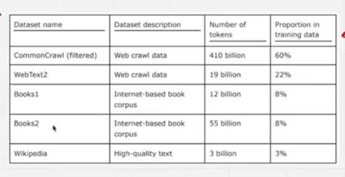
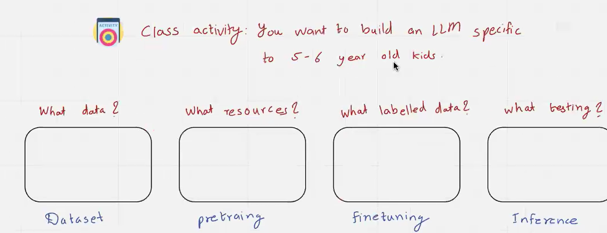
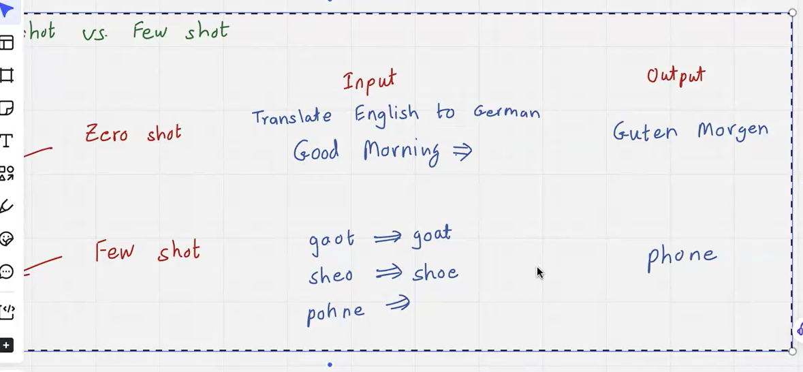
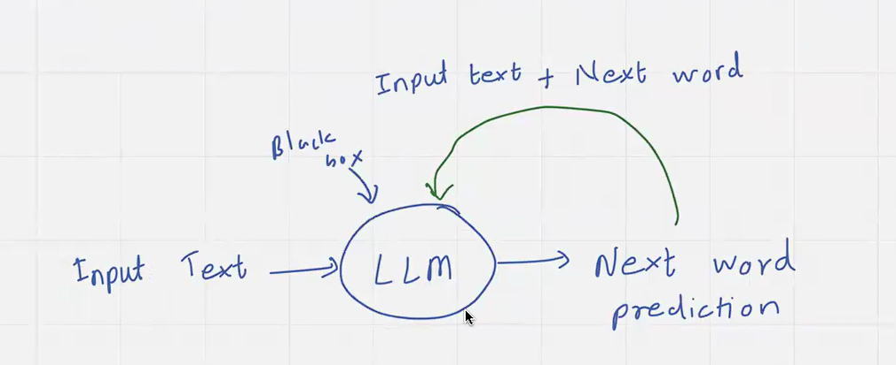

# Lecture 4 - GPT for 5-6 year old kid, Tokenization

- Pre training we pass raw unlabelled text
- Fine Tuning - Labelled Dataset

- DataSet
  - CMU Kids Corpus
  - FairTaleQA
  - Tiny Stories DataSet
- `pretraining` What resources ?
  - model will learn `Form` and `Meaning`
- `finetuning` - Labelled Data
  - other data sets
- testing

  - Testing using LLM
  -

- `LLMs are few shot learners`
- Language modeks are unsupervised multitask learners
-

