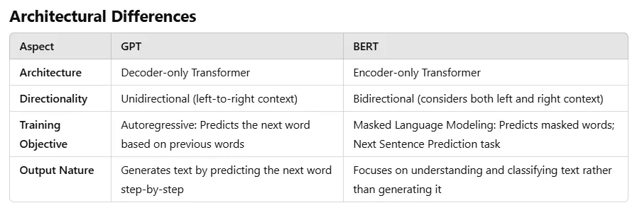

### Lecture 2 : Representational vs Generative models

- Google Colab: Load a language model using HuggingFace Pipeline
  https://colab.research.google.com/drive/1Zb9_BIDXNuWL8ugtWTxQO_ZMNSVBXj_w?usp=sharing

For Movie recomendation

- Bag of words could be used but context is not captured.
- Cosine Distance or Euclidian Distance
- Words are converted to Hidden Steate and passwed tom ENN




**Q : @49:28**
If u finetune the bert model and mask the last token will if become a GPT ?
https://www.perplexity.ai/search/if-u-finetune-the-bert-model-a-f4dXC1U2Rry2cJXcm1._Dw#0

**Q: @ 51:03**
Can we do Quantization on SLM with one bit SLM

### LLM Activity

@55:00

https://github.com/Mooler0410/LLMsPracticalGuide

- Encoder only model model is stagnant
- Decoder are popular now due to funding

### Closed Source vs Open Source LLM

### Interfacing LLMs

- Closed Source
  - User connects via API
- Open Source
  - User hosts LLM

### Open Source vs Open Weights

###

https://github.com/MoonshotAI/Kimi-K2

### Diffusion based Language Models

### InceptionLabs.ai


Left token prediction vs diffusion model
phi3-mini
[! Note]
Size of final logits Layer = Vocaulary Size x Context Window

------------ NoteBook GPT

```python
# %%capture
!pip install transformers>=4.40.1 accelerate>=0.27.2
```

```python
from transformers import AutoModelForCausalLM, AutoTokenizer

# Load model and tokenizer
model = AutoModelForCausalLM.from_pretrained(
    "microsoft/Phi-3-mini-4k-instruct",
    device_map="cuda",
    torch_dtype="auto",
    trust_remote_code=True,
)
tokenizer = AutoTokenizer.from_pretrained("microsoft/Phi-3-mini-4k-instruct")
```

```python
# Create a pipeline
from transformers import pipeline
generator = pipeline(
    "text-generation",
    model=model,
    tokenizer=tokenizer,
    return_full_text=False,
    max_new_tokens=500,
    do_sample=False
)
```

#### cache=True

#### do_sample=False

- **When we do_samples=True**
  does not take the word with the highest probability
  Then we gent more creative answers
  Gets data from binimoal or multinomial distribution.

- Qwen
- Gamma
  @q Why are encoder only models smaller than dcodeoer only model

### Papers :

[1] : https://github.com/microsoft/BitNet One Bit LLM - Microsoft bitnet

- https://ajithp.com/2024/03/09/bitnet-b1-58/
- 

- In represenational models we need to understand syax and grammer -

`Blue electrons eat fish.`

- A decoder model cannot such sentence sentence.
- Verb Object Subject is generated and not SVO
-

- Encoder only model have a finetuning step later.
- They don;t exist in Isolation
- GPT is able to do fill in the blanks due to fine tuning.
- nano GPT has difficuly following instructions.
-

- **Encoder Decoder is represenational and generative**

- Flash Attention
- Mutihead Latent Attention
- Window Attention

### Source :

- [1] https://medium.com/@vipra_singh/llm-architectures-explained-bert-part-8-c60c1d9ebc82
- [2] https://medium.com/@abhishekjainindore24/gpt-vs-bert-ba8f00ddda08
- [3] https://huggingface.co/microsoft/Phi-3-mini-4k-instruct

### Capstone Project model :

- Build LLM 1Bit SLM model to run on Android.
- Increase inference speed of LLMs
  - https://github.com/karpathy/build-nanogpt
  - Do same for KimiK2
  - or implement it in C and show it's benefits.
- LLAMA.cpp
