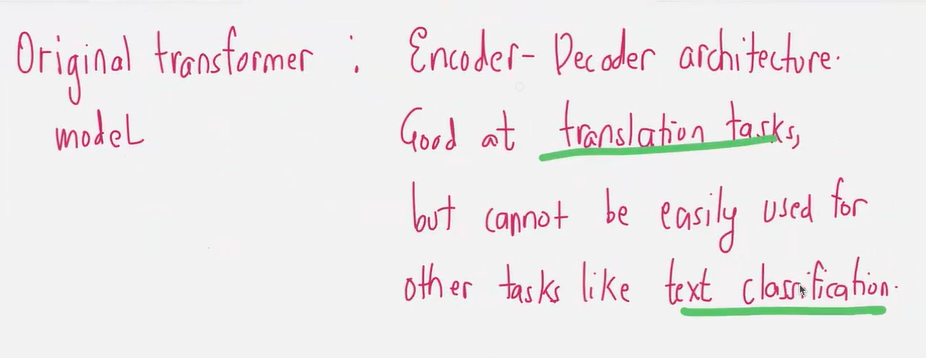
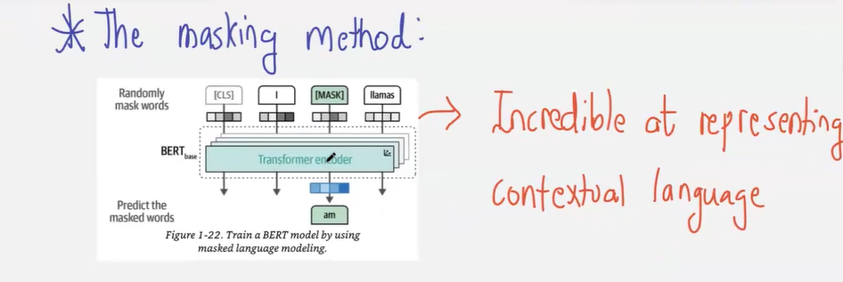
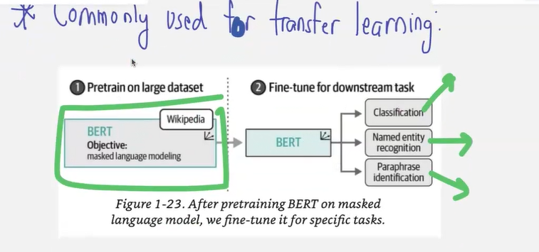
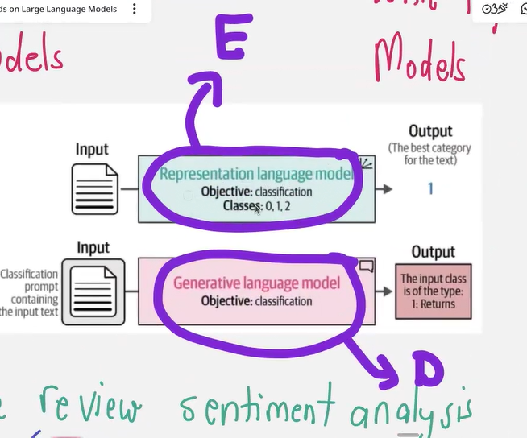
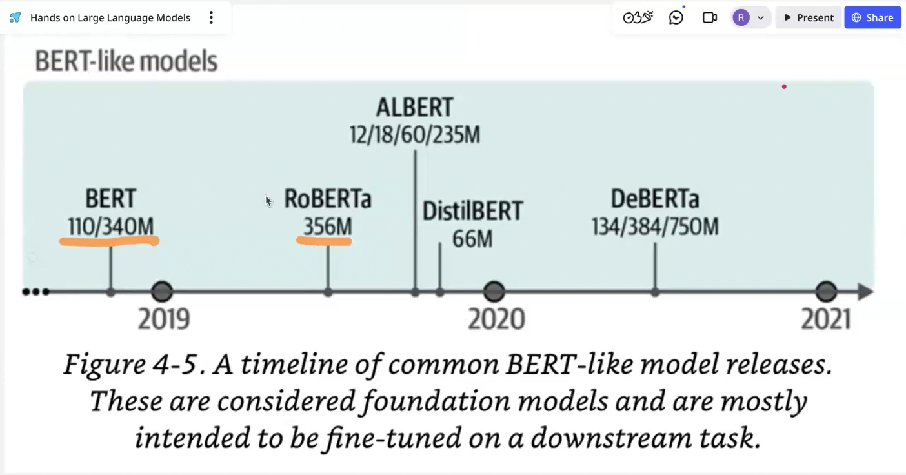
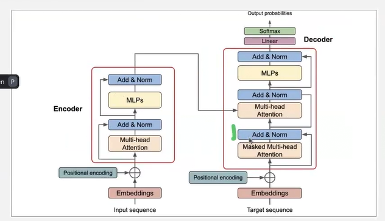

# Lecture 3 : Text Classification using Representation Models

We need to derive recomendations based on text we have about movie users watched

- `Bag of words`
  - Context was lost
- `Word to Vec` ie next level
- Every word is placed in a vector
- ## Issues :
  - With Averaging technique does not capture `Context`
- NN

  - `Long Context` - Cannot solve long paragraphs due context bottle neck issue in hidden layer.
    - Solved via `LSTM` which was a temporary fix
    - Permenttly solved with implementation of `Attention Mechanism` in 2014
      - When we decode we need to pay attention to each hidden state
      - The amount of attention is based on weights.
  - `Sequential Training` issue was solved when transformer architecture came out.
  -

  

### BERT

### decoder only architecture

## Pretrained only models are not good at following instructions

Example : LLAMA 8b instruct
https://huggingface.co/meta-llama/Meta-Llama-3-8B-Instruct

- Training these models is `Less intensive but more involved`
-

# Encoder only models are light weight

### Case study

- Legacy system in outdated language needs to be migrated.

## Solve using representative model approach

## Solve using generative model approach

    ### Data Drift

    ### Data Augumentation

## Encoder Model

https://huggingface.co/cardiffnlp/twitter-roberta-base
